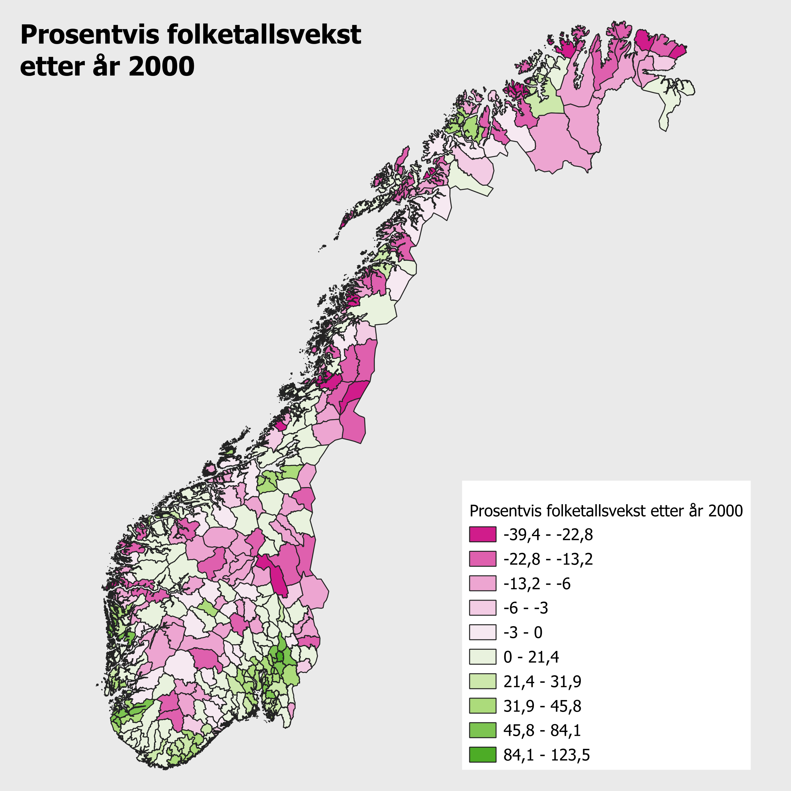
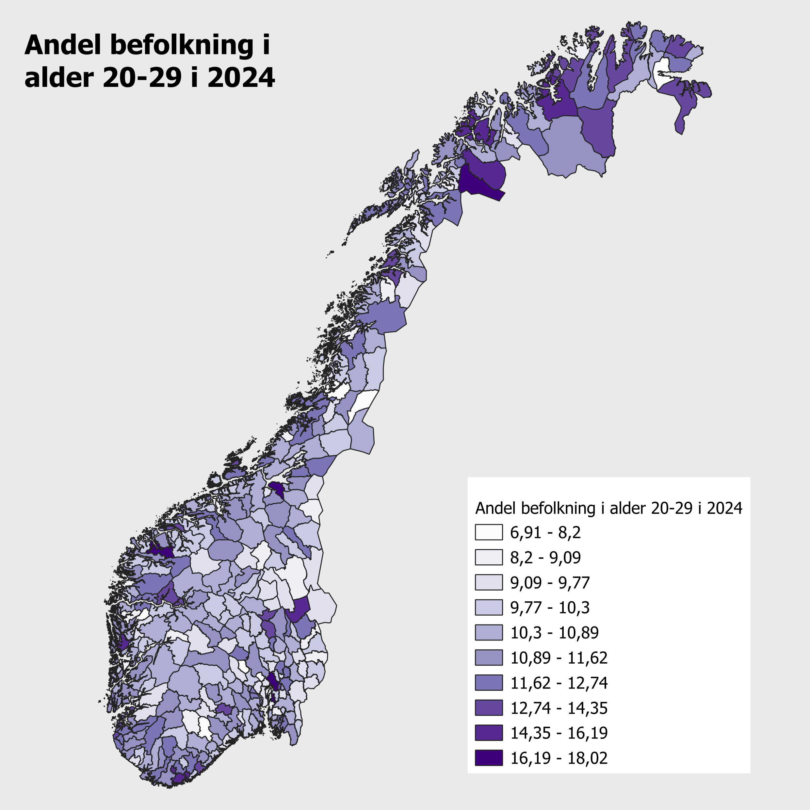
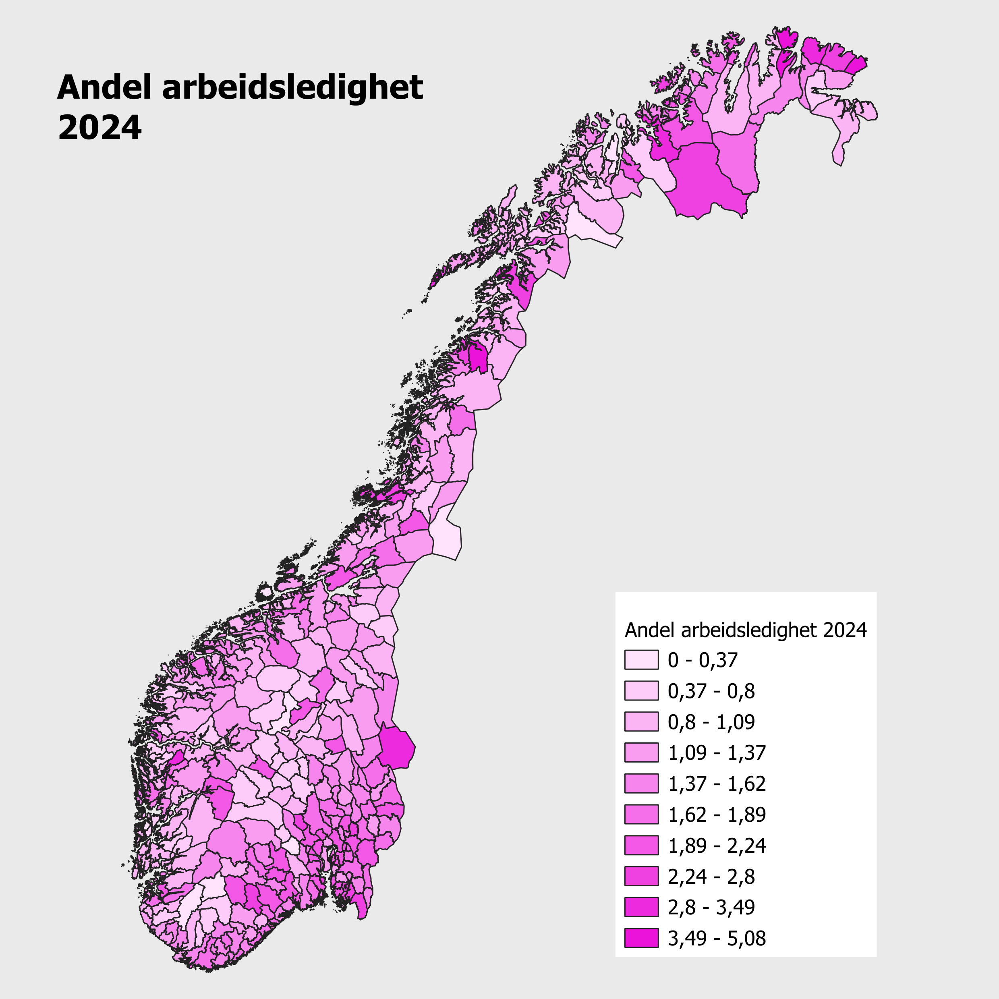
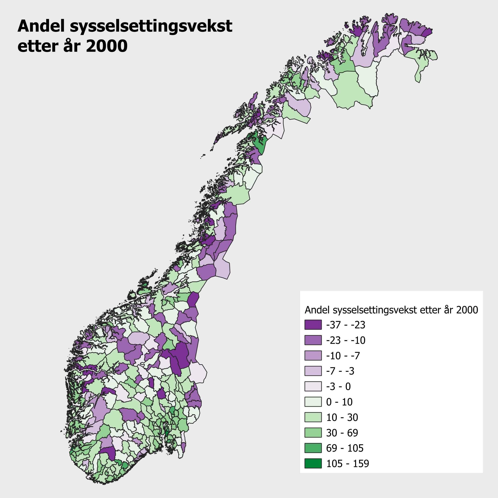
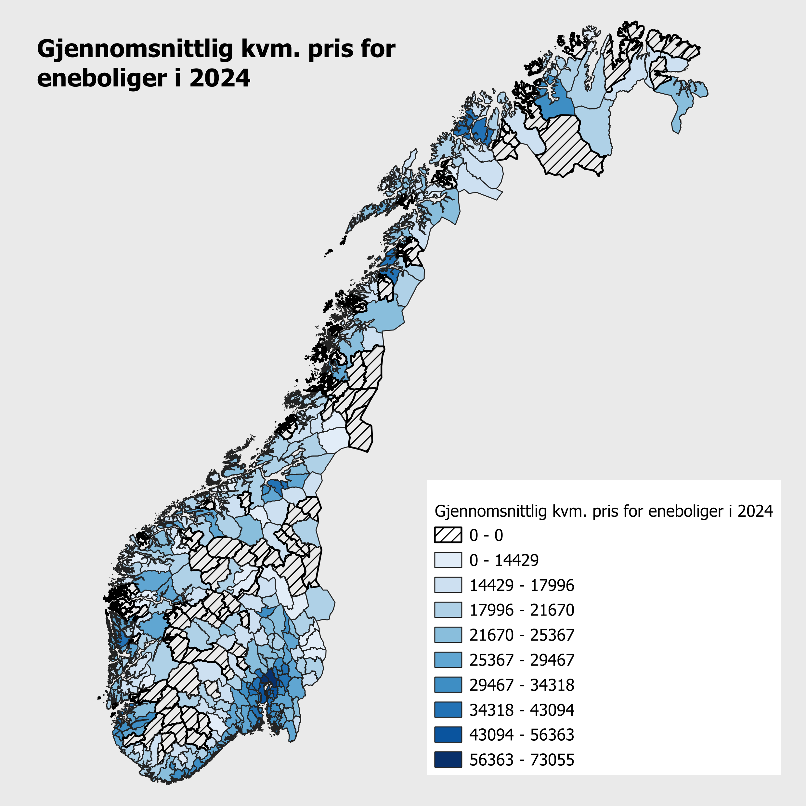
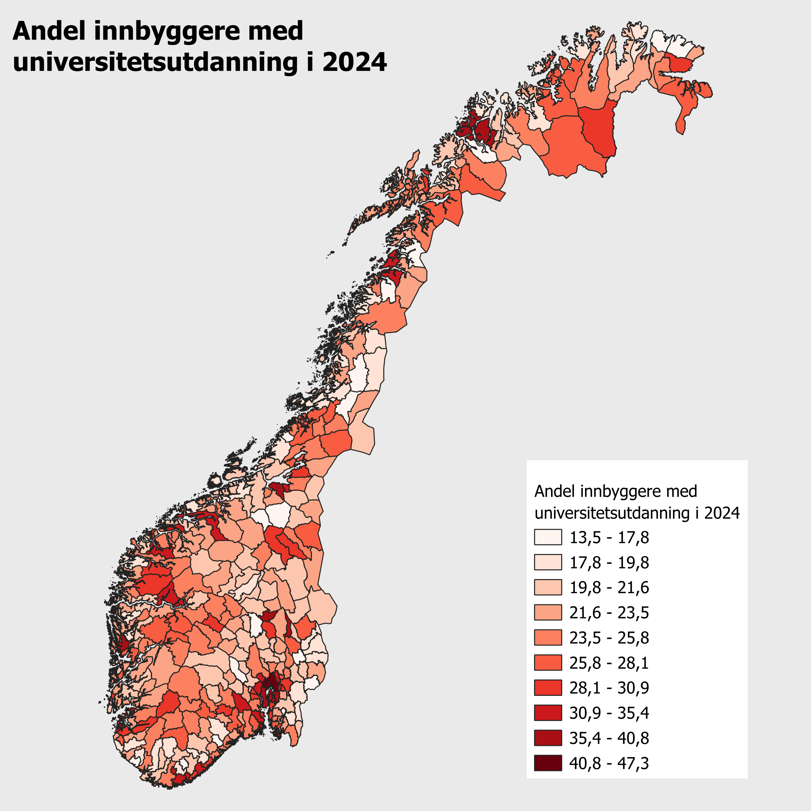
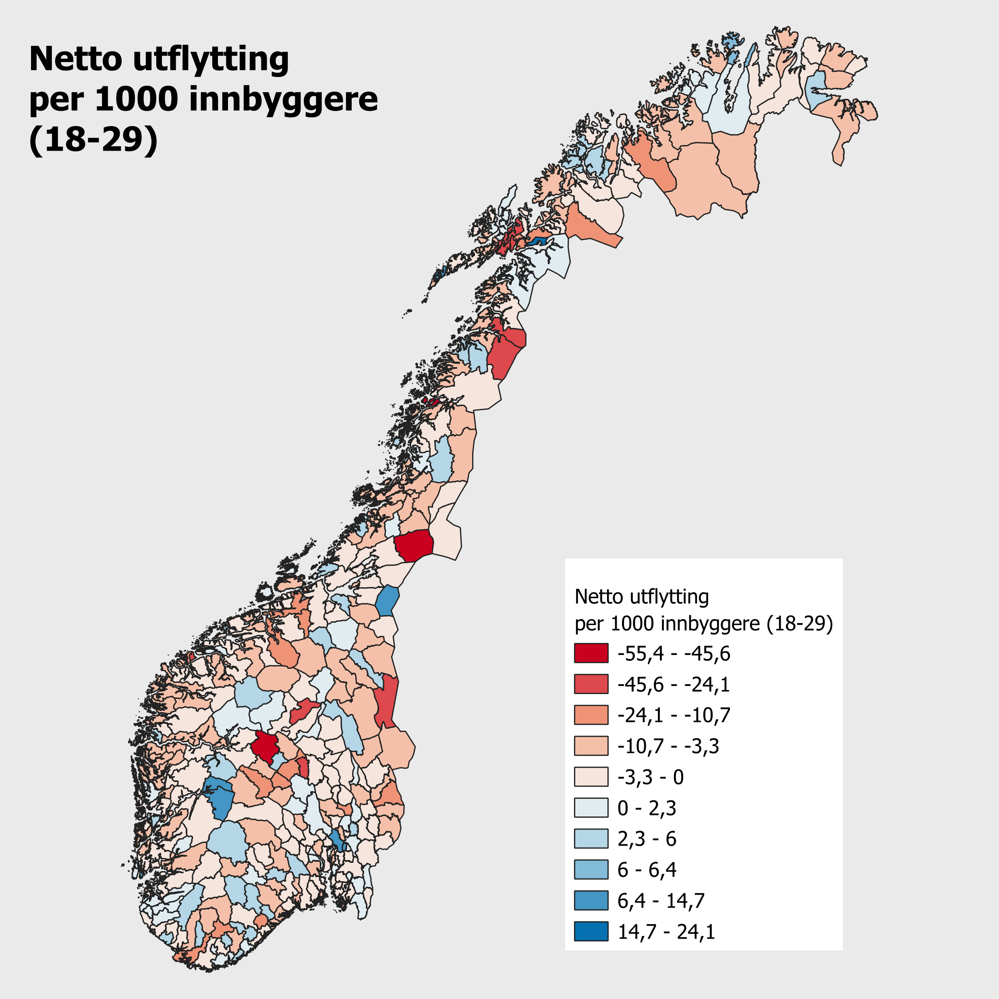
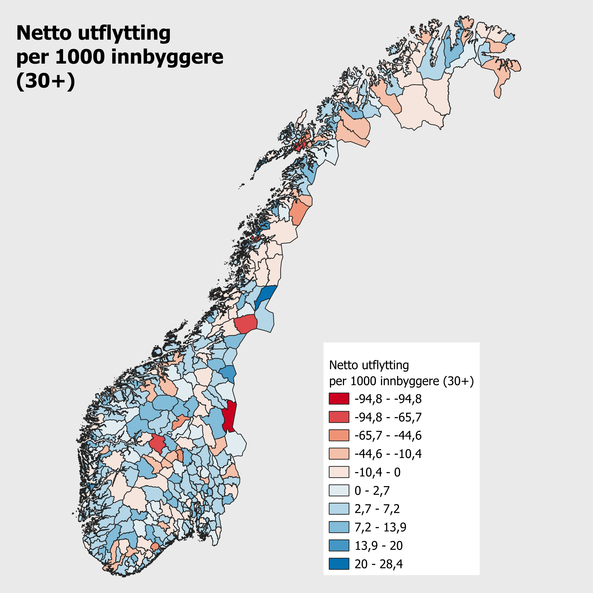

```{r}
#| label: setup
#| message: false
#| echo: true
#| warning: false
library(tidyverse)
library(readxl)
library(sf)
library(spdep)
library(writexl)
library(PxWebApiData)
library(modelsummary)
library(dplyr)
library(stringr)
library(writexl)
library(lmtest)
library(plm)

options(scipen = 999)
```

```{r}
t <- Sys.time()
```

# Innledning

# Innhenting av data

Merk at kommuneinndeling er gjeldende inntil 31.
desebember 2025 benyttes, grunnet endringer 1.
januar 2026 (disse vil ikke bli synlige i statistikken før i 2027, med unntak av folketall som kommer i februar 2026).

## Folketall

```{r}
load("nor_knr24_vec.rdata")
load("newknr24.rdata")
Sys.setlocale("LC_ALL", "Norwegian")
Sys.setlocale("LC_CTYPE", "Norwegian")
```

```{r}
 beftot <- PxData12(
   "https://data.ssb.no/api/v0/no/table/07459/",
   Region = list("agg:KommSummer", knr24),
   Tid = as.character(1986:2025),
   Alder = list("agg:TodeltGrupperingB", c("H17", "H18"))) |> 
   select(Region, år, value) |> 
   group_by(Region, år) |> 
   summarise(beftot = sum(value), .groups = "drop") |> 
   rename(knr24 = Region) |> 
   filter(!knr24 %in% c("K-21-22", "K-23", "K-Rest")) |> 
   mutate(knr24 = str_sub(knr24, 3, 6))
```

### Prosentvis folketallsvekst for ulike kommuner etter år 2000

```{r}
befendr0025 <- beftot |> 
  filter(år %in% c(2000, 2025)) |> 
   pivot_wider(
     names_prefix = "bef",
     names_from = år,
     values_from = beftot
   ) |> 
  mutate(befendr0025 = round(((bef2025-bef2000)/bef2000)*100, digits = 2)) |> 
  mutate(befendr0025 = case_when(
    is.infinite(befendr0025) ~ 0,
    .default = befendr0025
  )) |> 
  select(-c(bef2000, bef2025))
```

## Demografiske data

```{r}
befald <- PxData12(
  "https://data.ssb.no/api/v0/no/table/07459/",
  Region = list("agg:KommSummer", knr24),
  Tid = as.character(1986:2025),
  Alder = list("agg:TiAarigGruppering", 
               c("F00-09", "F10-19", "F20-29", "F30-39", "F40-49",
                 "F50-59", "F60-69", "F70-79", "F80-89", "F90-99",
                 "F100G10+"))) |> 
  select(Region, år, Alder, value) |> 
  group_by(Region, år, Alder) |> 
  summarise(befage = sum(value), .groups = "drop") |>
  rename(knr24 = Region) |> 
  filter(!knr24 %in% c("K-21-22", "K-23", "K-Rest")) |> 
  mutate(knr24 = str_sub(knr24, 3, 6))
```

### Andelen av befolkningen i aldersgruppen (20-29), for 2024

```{r}
befald <- befald |>
  left_join(
    y = beftot,
    join_by(knr24, år)
  ) |> 
  mutate(bef_andel_age = round((befage/beftot)*100, 2))
```

```{r}
befandel_wide <- befald |> 
  select(-c(befage, beftot)) |> 
  pivot_wider(
    names_from = Alder,
    names_prefix = "befAndel_",
    values_from = bef_andel_age
  ) |> 
  select(knr24:`befAndel_F10-19`, `befAndel_F20-29`:`befAndel_F90-99`, everything())
```

```{r}
bef_andel24 <- befald |> 
  filter(år == "2024",
         Alder == "F20-29") |> 
  select(-c(år, Alder, befage, beftot))
```

## Sentralitetsindeksen for norske kommuner

```{r}
sentralitet2023_2024 <-
  read_xlsx("sentralitet_2023-2024_kommuner.xlsx")
```

```{r}
sentralitet24 <- sentralitet2023_2024 |> 
  rename(knr24 = `knr 2024`,
         index = `Indeks 2023`,
         klasse = `Klasse 2023`) |> 
  select(knr24, index, klasse)
```

```{r}
# Importerer og leser av excel-filene
sentralitet2020 <- 
  read_xlsx("sentralitet2020Kommuner.xlsx")

sentralitet2023_2024 <-
  read_xlsx("sentralitet_2023-2024_kommuner.xlsx")

# Sammenslåeing av tabellene sånn at vi kan se utvikling.
Sentralitet <- left_join(sentralitet2020, sentralitet2023_2024, by = c("Kommune" = "Kommune 2024"), keep = TRUE)
```

SSB bruker sentralitetsindeksen for å beskrive hvor sentralt en kommune ligger.
Dette blir målt gjennom hvor lett det er for innbyggerne å komme seg til viktige funksjoner.
Indeksen SSB bruker bygger på beregnet reisetid med bil fra bebodde område istedenfor liftlonjeavstand eller innbyggertall som kunne vært bedre.
Poenget for indeksen er å fange opp faktisk tilgjengelighet som er at kommunene regnes som mer sentrale hvis mange arbeidsplasser og ulike tjenestetilbud kan nås innenfor rimelig reisetid.

Indeksen består av to deler.
Den ene handler om hvor stort arbeidsmarked innbyggerne har innenfor en reiseramme (opptil 90 minutter), altså hvor mange arbeidsplasser som kan nås.
Den andre handler om tilgang til et bredt tjenestetilbud, som typisk er ulike typer varer og tjenester (for eksempel handel og offentlige tjenester).
I begge delene er det lagt opp til korte reiser teller mer enn lange reiser.
Det vil si at en arbeidsplass eller tjeneste i nærheten påvirker sentraliteten mer enn en som ligger langt unna.
Kommunens endelige verdi uttrykkes som en kontinuerlig indeks (høyere verdi = mer sentral), og verdiene kan også sorteres inn i seks sentralitetsklasser.

Når vi skulle se på 2017 indeksen så var det ikke direkte sammenlignbart med de senere årene, vi valgte derfor å heller ta år 2020 å sammenligne de med 2023-2024.
En grunn til dette i indeksen for 2017 kan være pågrunn av i denne perioden har det vært endringer i kommuneinndelingen (sammenslåinger og grensejusteringer), som kan påvirke hvilken samlet verdi en kommune får.
I tillegg ble det påpekt feil knyttet til deler av beregningen i den tidlige versjonen av indeksen, som senere er korrigert.

```{r}
# Dette er hentet med hjelp av ChatGPT
# Klargjør datasett for test
Sentralitet_test <- Sentralitet %>%
  filter(!is.na(`Indeks 2020`), !is.na(`Indeks 2023`)) %>%
  mutate(diff_20_23 = `Indeks 2023` - `Indeks 2020`)

# Her velger vi hva vi vil ha i tabellen
oppsummering <- Sentralitet_test %>%
  summarise(
    n = n(),
    mean_change = mean(diff_20_23),
    median_change = median(diff_20_23),
    sd_change = sd(diff_20_23),
    min_change = min(diff_20_23),
    max_change = max(diff_20_23)
  )

oppsummering

# Signifikans-test
test_t <- t.test(Sentralitet_test$diff_20_23, mu = 0)
```

Utifra t-testen finner vi ut at sentralitetsindeksen fra 2020 til 2023 har ikke så store endringer.
Vi har med 341 kommuner, og i gjennomsnitt har indeksen økt med ca.
2,8 poeng.
Medianen er 2 som betyr at for de fleste kommunene er endringen veldig liten.
Det er likevel noen kommuner som skiller seg ut, der den største nedgangen er -17 og den største økningen er 79.
Totalt sett tyder dette på at sentraliteten er ganske stabil i perioden, men med noen få unntak.
Alt i alt virker det som at sentralitetsmønsteret ikke har endret seg noe særlig, og at endringene heller handler om små oppdateringer enn store skift.

## Prosentvis arbeidsledighet

### SSB

```{r}
arbledSSB <- PxData12(
  "https://data.ssb.no/api/v0/no/table/13563/",
  Region = list("agg:KommSummer", knr24),
  Tid = as.character(2008:2024),
  HovArbStyrkStatus = c("A", "A.09"), 
  Alder = "15+",
  InnvandrKat = "A-G") |> 
  select(Region, år, HovArbStyrkStatus, value) |>
  pivot_wider(
    names_from  = HovArbStyrkStatus,
    values_from = value) |>
  rename(
    arbstrk = A,
    regled_SSB = `A.09`) |>
  rename(knr24 = Region) |> 
  filter(!knr24 %in% c("K-21-22", "K-23", "K-Rest")) |> 
  mutate(knr24 = str_sub(knr24, 3, 6),
         andel_SSB = round((regled_SSB/arbstrk)* 100, 
                           digits = 2))
```

#### Prosentvis arbeidsledighet for 2024

```{r}
arbledSSB24 <- arbledSSB |> 
  filter(år == "2024") |> 
  select(-c(år, arbstrk, regled_SSB))
```

### NAV

```{r}
arbledNAV <- read_excel("NavTabell.xlsx",
                  sheet = 1,
                  skip = 4,
                  col_types = "text") 
```

```{r}
#| warning: false
arbledNAV <- arbledNAV |> 
  mutate(knr = str_pad(Kommunenr, 4, "left", "0"),
         regled_NAV = as.numeric(Beholdning),
         andel_NAV = as.numeric(`Andel av arbeidsstyrken`)) |> # Strengt tatt ikke nødvendig
  rename(år = År,
         mnd = Månedsnummer) |> 
  select(knr, år, mnd, regled_NAV) |> 
  left_join(
    y = newknr,
    join_by(knr)
  ) |> 
  group_by(knr24, år) |> 
  summarise(regled_NAV = round(mean(regled_NAV),
                               digits = 0),
            .groups = "drop") |> 
  left_join(
    y = arbledSSB,
    join_by(knr24, år)
  ) |> 
  mutate(andel_NAV = round((regled_NAV/arbstrk)* 100, 
                           digits = 2))
```

NAV og SSB (AKU) måler begge arbeidsledighet, men de gjør det på forksjellige måter.

NAV måler arbeidsledigheten utifra hvor mange som er registrert som helt arbeidsledige hos NAV.
Dataen til NAV bygger seg dermed opp på grunnlag av hvem som har meldt seg arbeidsledig i NAV-systemet.
NAV sine tall er avhengige av at arbeidsledige registrerte ledigeheten sin.
De blir og indirekte påvirket av hvilke regler som gjelder for å få hjelp (dagpenger) og at man må holde registreringen aktiv (fornye/holde registrering aktiv).

SSB sine tall kommer derimot fra AKU (Arbeidskraftundersøkelsen), som er en spørreundersøkelse der et utvalg av befolkningen blir intervjuet.
AKU måler arbeidsledigheten i hele befolkningen, Dette gjelder også personer som ikke er registrert hos NAV.
I AKU blir man regnet som arbeidsledig dersom man er uten jobb, har søkt jobb og er tilgjengelig for arbeid.

Begge disse statistikkene bygger på samme ide om hva arbeidsledighet er, men tallene kan bli forskjellige.
AKU fanger opp arbeidsledige som ikke melder seg hos NAV, og noen som er registrert hos NAV kan i AKU svare slik at de ikke blir klassifisert som arbeidsledige der.
I tillegg kan forskjeller i aldersavgrensning og tidspunktet det måles på bidra til at NAV- og AKU-tallene ikke blir like.

Kilde: <https://www.ssb.no/arbeid-og-lonn/sysselsetting/artikler/hvorfor-ulike-arbeidsledighetstall>

## Sysselsetting

```{r}
#| warning: false

arbpl <- pxwebData12(
  "https://data.ssb.no/api/v0/no/table/11616",
  Region = list("*"),
  ContentsCode = c("Arbeidssted"),
  Tid = as.character(2000:2024),
  Alder = "15-74"
)
```

```{r}
arbpl <- arbpl |>
  select(knr = Region, år, Arbeidssted) |>
  left_join(newknr, join_by(knr)) |>
  group_by(knr24, år) |>
  summarise(Arbeidssted = sum(Arbeidssted),
            .groups = "drop") |>
  filter(knr24 != "9999")
```

```{r}
sas <- left_join(
  arbpl,
  beftot,
  by = c("knr24", "år")
)
```

```{r}
sas <- sas %>%
  mutate(syss = Arbeidssted / beftot)
```

### Prosentvis sysselsettingsvekst for ulike kommuner etter år 2000

```{r}
syssendr0024 <- arbpl |> 
  filter(år %in% c(2000, 2024)) |> 
   pivot_wider(
     names_prefix = "syss",
     names_from = år,
     values_from = Arbeidssted
   ) |> 
  mutate(syssendr0024 = round(((syss2024-syss2000)/syss2000)*100, digits = 2)) |> 
  mutate(syssendr0024 = case_when(
    is.infinite(syssendr0024) ~ 0,
    .default = syssendr0024
  )) |> 
  select(-c(syss2000, syss2024))
```

## Gjennomsnittlig kvadratmeterpris for bolig

```{r}
#| warning: false
AMDBolig <- pxwebData12(
    urlToData = "https://data.ssb.no/api/v0/no/table/06035/",
    Region = list("*"),
    Boligtype = c("01", "03"),
    Tid = as.character(c(2002:2024)),
    ContentsCode = c("KvPris", "Omsetninger"))|> 
  select(knr = Region, år, boligtype, KvPris, Omsetninger)
```

```{r}
AMDBolig <- AMDBolig |> 
  left_join(
    y = newknr,
    join_by(knr)
  ) |> 
  group_by(knr24, år, boligtype) |> 
  summarise(KvPris = round(mean(KvPris, na.rm = TRUE), 0), 
            Omsetninger = sum(Omsetninger, na.rm = TRUE),
            .groups = "drop") |> 
  # pivot_wider(
  #   names_from = boligtype,
  #   names_prefix = "KvPris_",
  #   values_from = KvPris
  # ) |>
  filter(knr24 != "9999",
         !is.na(knr24))
```

```{r}
#| warning: false
kvmBolig <- pxwebData12(
    urlToData = "https://data.ssb.no/api/v0/no/table/06035/",
    Region = list("*"),
    Boligtype = c("01", "03"),
    Tid = as.character(c(2002:2024)),
    ContentsCode = "KvPris"
) |> 
  select(knr = Region, år, boligtype, KvPris)
```

```{r}
kvmBolig <- kvmBolig |> 
  left_join(
    y = newknr,
    join_by(knr)
  ) |> 
  group_by(knr24, år, boligtype) |> 
  summarise(KvPris = round(mean(KvPris, na.rm = TRUE), 0),
            .groups = "drop") |> 
  pivot_wider(
    names_from = boligtype,
    names_prefix = "KvPris_",
    values_from = KvPris
  ) |> 
  filter(knr24 != "9999",
         !is.na(knr24))
```

### Gjennomsnittlig kvadratmeterpris for boliger i 2024

```{r}
kvmBolig24 <- kvmBolig |> 
  filter(år == "2024") |> 
  mutate(KvPris_Blokkleiligheter = case_when(
    is.na(KvPris_Blokkleiligheter) ~ 0,
    .default = KvPris_Blokkleiligheter
  )) |> 
  mutate(KvPris_Eneboliger = case_when(
    is.na(KvPris_Eneboliger) ~ 0,
    .default = KvPris_Eneboliger
  )) |> 
  select(-år)
```

## Boliger solt per år

```{r}
solgteBolig <- pxwebData12(
  urlToData = "https://data.ssb.no/api/v0/no/table/06035/",
  Region = list("*"),
  Boligtype = c("01", "03"),          
  Tid = as.character(2002:2024),
  ContentsCode = "Omsetninger"
) |>
  select(
    knr = Region, år, boligtype, Omsetninger
  )
```

```{r}
solgteBolig <- solgteBolig |>
  left_join(newknr, join_by(knr)) |>
  group_by(knr24, år, boligtype) |>
  summarise(
    Omsetninger = sum(Omsetninger, na.rm = TRUE),
    .groups = "drop"
  ) |>
  pivot_wider(
    names_from = boligtype,
    names_prefix = "Antall_",
    values_from = Omsetninger
  ) |>
  filter(
    knr24 != "9999",
    !is.na(knr24)
  )
```

## Slår sammen datasett for boliger

```{r}
bolig <- left_join(
  kvmBolig,
  solgteBolig,
  by = c("knr24", "år")
)
```

## Utdanningsnivå

```{r}
#| warning: false
utdanning <- pxwebData12(
    urlToData = "https://data.ssb.no/api/v0/no/table/09429/",
    Region = list("*"),
    Tid = as.character(c(1970, 1980:2024)),
    Nivaa = c("03a", "04a"),
    Kjonn = "0",
    ContentsCode = "Personer"
)
```

```{r}
utdanning <- utdanning |>
  rename(knr= Region) |> 
  left_join(newknr, join_by(knr)) |>
  filter(!is.na(knr24)) |>
  group_by(knr24, år) |>
  summarise(UH = sum(Personer), .groups = "drop") |>
  filter(knr24 != "9999") |> 
  left_join(
    y = beftot,
    join_by(knr24, år)
  ) |> 
  group_by(knr24, år) |> 
  summarise(UH = sum(UH),
            beftot = sum(beftot),
            .groups = "drop") |> 
  mutate(UH_pct = round((UH/beftot)*100,
                        digits = 2))
```

For å finne utdanningsnivå har vi brukt tabellen 09429.
Denne tabellen har ikke et datasett for nye kommuner per 2024.
Vi måtte derfor hente ut alle kommunene og så sortere etter de nye kommunenavnene ved å bruke "newknr".
Videre hentet vi ut data for begge kjønn og hentet ut bare høyere utdanning da vi så at det er det oppgaven krever.
Dataene var delt inn i "Universitets- og høgskolenivå, kort" og "Universitets- og høgskolenivå, lang", disse har vi slått sammen.
Vi har også filtrert vekk data for hele landet samlet.

### Andelen av innbyggerne med universitetsutdanning, i 2024

```{r}
utd24 <- utdanning |> 
  filter(år == "2024") |> 
  select(-c(år, UH, beftot))
```

### Utviklingen i andelen av innbyggerne med universitetsutdanning, etter 1970

```{r}
utdAndel <- utdanning |> 
  left_join(
    y = sentralitet24,
    join_by(knr24)
  ) |> 
  group_by(klasse, år) |> 
  summarise(UH = sum(UH, na.rm = TRUE),
            beftot = sum(beftot),
            .groups = "drop") |> 
  mutate(UH_pct = round((UH/beftot)*100,
                        digits = 2))
```

## Ut- og innflytnninger pr 1000 innbyggere

```{r}
#| warning: false
flytting <- pxwebData12(
  urlToData = "https://data.ssb.no/api/v0/no/table/13255/",
  Region = list("*"),
  Alder = c("18-29", "30+"),
  Tid = as.character(2010:2024)
)
```

```{r}
flytting <- flytting |>
  rename(knr = Region) |> 
  left_join(newknr, join_by(knr)) |>
  filter(!is.na(knr24)) |>
  select(knr24, år, Alder, Innflytting, Utflytting) |> 
  group_by(knr24, år, Alder) |>
  summarise(innflytting = sum(Innflytting),
            utflytting = sum(Utflytting), 
            .groups = "drop") |>
  filter(knr24 != "9999") |> 
  mutate(innflytting = case_when(
    is.na(innflytting) ~ 0,
    .default = innflytting
  )) |> 
  mutate(utflytting = case_when(
    is.na(utflytting) ~ 0,
    .default = utflytting
  )) |> 
  mutate(nettoflytting = innflytting - utflytting) 
```

### "Prosentvis" netto utflytting pr 1000 innbyggere

```{r}
# Merk at prosentvis er misvisende når en ønsker en rate per 1000 innbyggere

nettoFlytt24 <- flytting |> 
  filter(år == "2024") |> 
  left_join(
    y = beftot,
    join_by(knr24, år)
  ) |> 
  mutate(nettoflytting1k = round((nettoflytting/beftot)*1000,
                                 digits = 2)) |> 
  select(knr24, år, Alder, nettoflytting1k) |> 
  pivot_wider(
    names_from = Alder,
    names_prefix = "nettoflytting_",
    values_from = nettoflytting1k
  ) |> 
  select(-år)
```

## Inn- og utpendling

```{r}
#| warning: false
pendl <- pxwebData12(
  "https://data.ssb.no/api/v0/no/table/11616",
  Region = list("*"),
  ContentsCode = c("Bosatt", "Innpendlere", "Utpendlere", "Arbeidssted"),
  Tid = as.character(2000:2024),
  Alder = "15-74"
)
```

```{r}
pendl <- pendl |>
  select(knr = Region, år, Bosatt, Innpendlere, Utpendlere, Arbeidssted) |>
  left_join(newknr, join_by(knr)) |>
  group_by(knr24, år) |>
  summarise(Bosatt = sum(Bosatt),
      Innpendlere = sum(Innpendlere),
      Utpendlere = sum(Utpendlere),
      Arbeidssted = sum(Arbeidssted),
      .groups = "drop") |>
  filter(knr24 != "9999") |> 
  mutate(nettoPendl = Innpendlere - Utpendlere)
```

### "Prosentvis" netto innpendling pr 1000 arbeidsplasser

```{r}
# Merk at prosentvis er misvisende når en ønsker en rate per 1000 arp.plasser

nettoPendl24 <- pendl |> 
  filter(år == "2024") |> 
  mutate(nettoInnPendl1k = round((nettoPendl/Arbeidssted)*1000,
                               digits = 2)) |> 
  mutate(nettoInnPendl1k = case_when(
    is.infinite(nettoInnPendl1k) ~ 0,
    .default = nettoInnPendl1k
  )) |> 
  select(knr24, nettoInnPendl1k)
```

------------------------------------------------------------------------

Gjenstår også å sette sammen datasett for alle kurveframstillinger (utenom utvkl. UH-utdanning).
Denne jobben er imidlertid stort sett copy/paste der sentr joines på og aktuelle data grupperes på klasse.

# Master Data Sets

```{r}
#master for 2024 per kommune
master24 <- reduce(
  list(
    befendr0025,
    bef_andel24,
    arbledSSB24,
    syssendr0024,
    kvmBolig24,
    utd24,
    nettoFlytt24,
    nettoPendl24
  ),
  left_join,
  by = "knr24"
)
```

```{r}
#Samlet master sett med knr24 x år

#wide på Alder
flytting_wide <- flytting |>
  left_join(beftot, by = c("knr24", "år")) |>  # beftot har totalbefolkning per kommune-år
  mutate(
    innflytting1k = round((innflytting / beftot) * 1000, 2),
    utflytting1k = round((utflytting / beftot) * 1000, 2),
    nettoflytting1k = round((innflytting - utflytting) / beftot * 1000, 2)
  ) |>
  mutate(
    innflytting1k = if_else(is.infinite(innflytting1k), 0, innflytting1k),
    utflytting1k = if_else(is.infinite(utflytting1k), 0, utflytting1k),
    nettoflytting1k = if_else(is.infinite(nettoflytting1k), 0, nettoflytting1k)
  ) |>
  select(knr24, år, Alder, innflytting1k, utflytting1k, nettoflytting1k) |>
  pivot_wider(
    names_from = Alder,
    names_glue = "{.value}_{Alder}",
    values_from = c(innflytting1k, utflytting1k, nettoflytting1k)
  ) |>
  mutate(
    innflytting1k_tot = coalesce(`innflytting1k_18-29`, 0) + coalesce(`innflytting1k_30+`, 0),
    utflytting1k_tot = coalesce(`utflytting1k_18-29`, 0) + coalesce(`utflytting1k_30+`, 0),
    nettoflytting1k_tot = coalesce(`nettoflytting1k_18-29`, 0) + coalesce(`nettoflytting1k_30+`, 0)
  )

#Pendling (rate per 1000 arbeidsplasser)
pendl_rate <- pendl |>
  mutate(
    innPendl1k = round((Innpendlere / Arbeidssted) * 1000, 2),
    utPendl1k  = round((Utpendlere / Arbeidssted) * 1000, 2),
    nettoInnPendl1k = round((nettoPendl / Arbeidssted) * 1000, 2)
  ) |>
  mutate(
    innPendl1k = if_else(is.infinite(innPendl1k), 0, innPendl1k),
    utPendl1k  = if_else(is.infinite(utPendl1k), 0, utPendl1k),
    nettoInnPendl1k = if_else(is.infinite(nettoInnPendl1k), 0, nettoInnPendl1k)
  ) |>
  select(
    knr24,
    år,
    innPendl1k,
    utPendl1k,
    nettoInnPendl1k
  )

#Lager master (knr24 x år) + legg på kommune-only variablar
panel_list <- list(
  beftot,
  befandel_wide,
  arbledSSB,
  arbledNAV,
  arbpl,
  kvmBolig,
  utdanning,
  flytting_wide,
  pendl_rate,
  sas
)

master <- reduce(panel_list, left_join, by = c("knr24","år")) |>
  left_join(sentralitet24, by = "knr24") |>
  left_join(befendr0025,  by = "knr24") |>
  left_join(syssendr0024, by = "knr24")

```

## Data kart -- "Oppgave" 2, del 1

```{r}
kartdata <- befendr0025  |> 
  left_join(
    y = bef_andel24,
    join_by(knr24)
  ) |> 
  left_join(
    y = arbledSSB24,
    join_by(knr24)
  ) |> 
  left_join(
    y = syssendr0024,
    join_by(knr24)
  ) |> 
  left_join(
    y = kvmBolig24,
    join_by(knr24)
  ) |> 
  left_join(
    y = utd24,
    join_by(knr24)
  ) |> 
  left_join(
    y = nettoFlytt24,
    join_by(knr24)
  ) |> 
  left_join(
    y = nettoPendl24,
    join_by(knr24)
  )
```

## Koble kart

```{r}
kyst <- st_read(
  dsn = "knr_kart_norge_kystlinje.gpkg",
  layer = "Kommuner"
) |> 
  rename(knr24 = kommunenummer)
```

```{r}
kyst2 <- kyst |> 
  left_join(
    y = kartdata,
    join_by(knr24)
  )
```

```{r}
#| eval: false
st_write(
  obj = kyst2,
  dsn = "Kart_ArbkravMSB106.gpkg",
  layer = "knr_data",
  append = FALSE
)
```

```{r}
#| eval: false
st_write(
  obj = kyst2,
  dsn = "knr_kart_norge_kystlinje.gpkg",
  layer = "knr_data",
  append = FALSE
)
```

### Prosentvis folketallsvekst for ulike kommuner etter år 2000

 \### Andelen av befolkningen i aldersgruppen (20-29), for 2024

 \### Prosentvis arbeidsledighet for 2024

 \### Prosentvis sysselsettingsvekst for ulike kommuner etter år 2000

 \### Gjennomsnittlig kvadratmeterpris for boliger i 2024

 \### Andelen av innbyggerne med universitetsutdanning, i 2024

 \### Prosentvis netto utflytting pr 1000 innbyggere

  \### Prosentvis netto innpendling pr 1000 arbeidsplasse
r


## Data graf -- "Oppgave" 2, del 2

### Folketallsutvikling for årene etter 2000 for ulike sentralitetskategorier av kommuner

```{r}
befutv0025 <- beftot |>
  left_join(y = sentralitet24, join_by(knr24)) |> 
  group_by(klasse, år) |>
  summarise(beftot = sum(beftot), .groups = "drop")
```

```{r}
befutv0025 |>
filter(år %in% as.character(2000:2024)) |> 
  mutate(klasse = fct(as.character(klasse))) |>
  mutate(år = as.Date.character(år, format = "%Y")) |>
  ggplot(
  aes(x = år, y = beftot/1000, group = klasse, color = klasse)) + geom_line(size = 0.8) + 
  theme(legend.position = "bottom") + scale_x_date(date_breaks = "5 years", date_labels = "%Y") + ylab("Befolkning (1000)")

ggsave("folketallutv.png",
       width = 2560,
       height = 1600,
       units = "px",
       dpi = 300)
```

### Utviklingen i andelen av innbyggere i aldersgruppen (20-29) for årene etter 2000

```{r}
befald0025 <- befald |> filter(Alder == "F20-29") |>
  left_join(y = sentralitet24, join_by(knr24)) |> 
  group_by(klasse, år) |>
  summarise(befage = sum(befage), beftot = sum(beftot), .groups = "drop") |>
  mutate(bef_andel_age = round((befage/beftot)*100, 2))
```

```{r}
befald0025 |> 
  filter(år %in% as.character(2000:2024)) |> 
  mutate(klasse = fct(as.character(klasse))) |>
  mutate(år = as.Date.character(år, format = "%Y")) |>
  ggplot(
  aes(x = år, y = bef_andel_age, group = klasse, color = klasse)) + geom_line(size = 0.8) + 
  theme(legend.position = "bottom") + scale_x_date(date_breaks = "5 years", date_labels = "%Y") + ylab("Ung befolkning i %")

ggsave("bef2029utv.png",
       width = 2560,
       height = 1600,
       units = "px",
       dpi = 300)
```

### Utviklingen i prosentvis arbeidsledighet etter 2008

```{r}
arbled0024 <- arbledSSB |> 
    left_join(y = sentralitet24, join_by(knr24)) |> 
  group_by(klasse, år) |>
  summarise(regled_SSB = sum(regled_SSB), arbstrk = sum(arbstrk), .groups = "drop") |>  mutate(andel_SSB = round((regled_SSB/arbstrk)*100, 2))
```

```{r}
arbled0024 |>
   filter(år %in% as.character(2008:2024)) |> 
  mutate(klasse = fct(as.character(klasse))) |>
  mutate(år = as.Date.character(år, format = "%Y")) |>
  ggplot(
  aes(x = år, y = andel_SSB, group = klasse, color = klasse)) + geom_line(size = 0.8) + 
  theme(legend.position = "bottom") + scale_x_date(date_breaks = "5 years", date_labels = "%Y") + ylab("Andel arbeidsledige")

ggsave("arbledutv.png",
       width = 2560,
       height = 1600,
       units = "px",
       dpi = 300)
```

### Sysselsettingsvekst for årene etter 2000

```{r}
syssvekst0024 <- arbpl |> 
  filter(år %in% c(2000:2024))  |>
  left_join(y = sentralitet24, join_by(knr24)) |> 
  group_by(klasse, år) |>
  summarise(Arbeidssted = sum(Arbeidssted), .groups = "drop")
```

```{r}
syssvekst0024 |>
  mutate(klasse = fct(as.character(klasse))) |>
  mutate(år = as.Date.character(år, format = "%Y")) |>
  ggplot(
  aes(x = år, y = Arbeidssted/1000, group = klasse, color = klasse)) + geom_line(size = 0.8) + 
  theme(legend.position = "bottom") + scale_x_date(date_breaks = "5 years", date_labels = "%Y") + ylab("Sysselsatte (1000)")

ggsave("syssutv.png",
       width = 2560,
       height = 1600,
       units = "px",
       dpi = 300)
```

### Utvikling i kvadratmeterpris for boliger etter år 2002

```{r}
kvmpris0224 <- AMDBolig |>
      left_join(y = sentralitet24, join_by(knr24)) |> 
  group_by(klasse, år, boligtype) |>
  summarise(OmsetningerT = sum(Omsetninger, na.rm = TRUE),
            KvPrisW = ifelse(OmsetningerT>0, weighted.mean(KvPris, Omsetninger, na.rm = TRUE), NA), .groups = "drop")

```

```{r}
kvmpris0224 |>
  mutate(klasse = fct(as.character(klasse))) |>
  mutate(år = as.Date.character(år, format = "%Y")) |>
  ggplot(
  aes(x = år, y = KvPrisW, group = klasse, color = klasse)) + 
  facet_wrap(~ boligtype) + geom_line(size = 0.8) + 
  theme(legend.position = "bottom") + scale_x_date(date_breaks = "5 years", date_labels = "%Y") + ylab("Kvm pris")

ggsave("kvmprisutv.png",
       width = 2560,
       height = 1600,
       units = "px",
       dpi = 300)
```

### Utviklingen i andelen av innbyggerne med universitetsutdanning

```{r}
utdAndel |> 
  filter(år %in% as.character(1986:2024)) |>
  mutate(klasse = fct(as.character(klasse))) |>
  mutate(år = as.Date.character(år, format = "%Y")) |>
  ggplot(
  aes(x = år, y = UH_pct, group = klasse, color = klasse)) + geom_line(size = 0.8) + 
  theme(legend.position = "bottom") + scale_x_date(date_breaks = "5 years", date_labels = "%Y") + ylab("Andel utdannede")

ggsave("utdutv.png",
       width = 2560,
       height = 1600,
       units = "px",
       dpi = 300)
```

### Utviklingen i netto utflytting for ulike sentralitetskategorier av kommuner, etter 2010

```{r}
flytt1024 <- flytting |>
  left_join(y = sentralitet24, join_by(knr24)) |> 
  left_join(y = beftot, join_by(knr24, år)) |>
  group_by(klasse, år, Alder) |>
  summarise(beftotS = sum(beftot), 
            innflytting = sum(innflytting),
            utflytting = sum(utflytting), .groups = "drop") |>
  mutate(nettoflytting = innflytting - utflytting) |>
  mutate(nettoflytting1k = round((nettoflytting/beftotS)*1000, digits = 2))
```

```{r}
flytt1024 |>
  filter(år %in% as.character(2010:2024)) |>
  mutate(klasse = fct(as.character(klasse))) |>
  mutate(år = as.Date.character(år, format = "%Y")) |>
  ggplot(
  aes(x = år, y = nettoflytting1k, group = klasse, color = klasse)) + facet_wrap(~ Alder) + geom_line(size = 0.8) + 
  theme(legend.position = "bottom") + scale_x_date(date_breaks = "5 years", date_labels = "%Y") + ylab("Netto utflytting")

ggsave("flyttutv.png",
       width = 2560,
       height = 1600,
       units = "px",
       dpi = 300)

```

### Utviklingen i netto innpendling for ulike sentralitetskategorier av kommuner, etter 2000

```{r}
pendl0024 <- pendl |> 
  left_join(y = sentralitet24, join_by(knr24)) |>
  group_by(klasse, år) |>
  summarise(Bosatt = sum(Bosatt),
      Innpendlere = sum(Innpendlere),
      Utpendlere = sum(Utpendlere),
      Arbeidssted = sum(Arbeidssted),
      .groups = "drop") |>
  mutate(nettoPendl = Innpendlere - Utpendlere) |>
  mutate(nettoInnPendl1k = round((nettoPendl/Arbeidssted)*1000, digits = 2)) |>
  mutate(nettoInnPendl1k = case_when(
    is.infinite(nettoInnPendl1k) ~ 0,
    .default = nettoInnPendl1k
  ))
```

```{r}
pendl0024 |>
  filter(år %in% as.character(2000:2024)) |>
  mutate(klasse = fct(as.character(klasse))) |>
  mutate(år = as.Date.character(år, format = "%Y")) |>
  ggplot(
  aes(x = år, y = nettoInnPendl1k, group = klasse, color = klasse)) + geom_line(size = 0.8) + 
  theme(legend.position = "bottom") + scale_x_date(date_breaks = "5 years", date_labels = "%Y") + ylab("Netto innpendlig")

ggsave("pendlutv.png",
       width = 2560,
       height = 1600,
       units = "px",
       dpi = 300)
```

## Data tidsserier -- Samlet innlest data fra "Oppgave" 1

```{r}

```

# Tilstand og utvikling for ulike variabler

# Korrelasjonsberegninger

Lager en funksjon som kan brukes til å utføre korelasjons beregningene med mindre koding

```{r}
kor_år <- function(data, x, y) {
  data |>
    filter(år %in% c(2014, 2024)) |>
    group_by(år) |>
    summarise(
      korrelasjon = cor(
        .data[[x]],
        .data[[y]],
        use = "complete.obs"
      ),
      n = sum(!is.na(.data[[x]]) & !is.na(.data[[y]])),
      .groups = "drop"
    )
}
```

Folketall og andelen av innbyggerne som er i aldersgruppen (20-29)

```{r}

kor_år(master, "beftot.x", "befAndel_F20-29")|>
knitr::kable(
    caption = "Folketall og andel innbyggere i alder 20-29"
  )
```

Sentralitetsindeks og andelen av innbyggerne som er i aldersgruppen (20-29)

```{r}

kor_år(master, "index", "befAndel_F20-29")|>
knitr::kable(
    caption = "Sentralitetsindeks og andel innbyggere i alder 20-29"
  )
```

Sentralitetsindeks og prosentvis arbeidsledighet

```{r}

kor_år(master, "index", "andel_SSB.x")|>
knitr::kable(
    caption = "Sentralitetsindeks og ptosentvis arbeidsledighet"
  )
```

Sentralitetsindeks og gjennomsnittlig kvadratmeterpris for bolig

```{r}

kor_år(master, "index", "KvPris_Blokkleiligheter")|>
knitr::kable(
    caption = "Sentralitetsindeks og gjennomsnittlig kvadratmeterpris"
  )
```

Sentralitetsindeks og andelen av innbyggerne med høyere utdanning

```{r}

kor_år(master, "index", "UH_pct")|>
knitr::kable(
    caption = "Sentralitetsindeks og andelen av innbyggerne med høyere utdanning"
  )
```

Sentralitetsindeks og utflytting pr 1000 innbyggere

```{r}

kor_år(master, "index", "utflytting1k_tot")|>
knitr::kable(
    caption = "Sentralitetsindeks og utflytting pr 1000 innbyggere"
  )
```

Sentralitetsindeks og innpendling pr 1000 innbyggere

```{r}

kor_år(master, "index", "innPendl1k")|>
knitr::kable(
    caption = "Sentralitetsindeks og innpendling pr 1000 innbyggere "
  )
```

Sentralitetsindeks og utpendling pr 1000 innbyggere

```{r}

kor_år(master, "index", "utPendl1k")|>
knitr::kable(
    caption = "Sentralitetsindeks og utpendling pr 1000 innbyggere "
  )
```

Prosentvis arbeidsledighet og andelen av innbyggerne som er i aldersgruppen (20-29)

```{r}

kor_år(master, "andel_SSB.x", "befAndel_F20-29")|>
knitr::kable(
    caption = "Arbeidsledighet og andelen av innbyggerne som er i aldersgruppen (20-29) "
  )
```

Prosentvis arbeidsledighet og gjennomsnittlig kvadratmeterpris for bolig

```{r}

kor_år(master, "andel_SSB.x", "KvPris_Blokkleiligheter")|>
knitr::kable(
    caption = "Arbeidsledighet og gjennomsnittlig kvadratmeterpris) "
  )
```

Prosentvis arbeidsledighet og andelen av innbyggerne med høyere utdanning

```{r}

kor_år(master, "andel_SSB.x", "UH_pct")|>
knitr::kable(
    caption = "Arbeidsledighet og andelen av innbyggerne med høyere utdanning) "
  )
```

Prosentvis arbeidsledighet og brutto/netto utflytting pr 1000 innbyggere

```{r}
kor_år(master, "andel_SSB.x", "utflytting1k_tot")|>
knitr::kable(
    caption = "Arbeidsledighet og brutto utflytting"
  )

```


```{r}
kor_år(master, "andel_SSB.x", "nettoflytting1k_tot")|>
knitr::kable(
    caption = "Arbeidsledighet og netto utflytting"
  )
```

Prosentvis arbeidsledighet og brutto/netto utpendling pr 1000 innbyggere

```{r}
kor_år(master, "andel_SSB.x", "utPendl1k")|>
knitr::kable(
    caption = "Arbeidsledighet og brutto utpendling"
  )
```

```{r}
kor_år(master, "andel_SSB.x", "nettoInnPendl1k")|>
knitr::kable(
    caption = "Arbeidsledighet og netto pendling"
  )


```

Gjennomsnittlig kvadratmeterpris for bolig og andelen av innbyggerne med høyere utdanning

```{r}
kor_år(master, "KvPris_Blokkleiligheter", "UH_pct")|>
knitr::kable(
    caption = "Gjennomsnittlig KVM pris og andel høyere utdanning"
  )

```

Gjennomsnittlig kvadratmeterpris for bolig og andelen av innbyggerne som er i aldersgruppen (20-29)

```{r}
kor_år(master, "KvPris_Blokkleiligheter", "befAndel_F20-29")|>
knitr::kable(
    caption = "Gjennomsnittlig KVM pris og andel innbyggere i alder 20-29"
  )
```

Gjennomsnittlig kvadratmeterpris for bolig og innpendling pr 1000 innbyggere

```{r}
kor_år(master, "KvPris_Blokkleiligheter", "innPendl1k")|>
knitr::kable(
    caption = "Gjennomsnittlig KVM pris og innpendling"
  )
```

Gjennomsnittlig kvadratmeterpris for bolig og utpendling pr 1000 innbyggere

```{r}
kor_år(master, "KvPris_Blokkleiligheter", "utPendl1k")|>
knitr::kable(
    caption = "Gjennomsnittlig KVM pris og innpendling"
  )
```

Gjennomsnittlig kvadratmeterpris for bolig og utflytting pr 1000 innbyggere

```{r}
kor_år(master, "KvPris_Blokkleiligheter", "utflytting1k_tot")|>
knitr::kable(
    caption = "Gjennomsnittlig KVM pris og utflytting"
  )
```

Gjennomsnittlig kvadratmeterpris for bolig og innflytting pr 1000 innbyggere

```{r}
kor_år(master, "KvPris_Blokkleiligheter", "innflytting1k_tot")|>
knitr::kable(
    caption = "Gjennomsnittlig KVM pris og innflytting"
  )
```

Netto utflytting og andelen av innbyggerne som er i aldersgruppen (20-29)

```{r}
kor_år(master, "nettoflytting1k_tot", "befAndel_F20-29")|>
knitr::kable(
    caption = "Netto flytting og andel befolkning alder 20-29"
  )
```

Netto utflytting og netto utpendling pr 1000 innbyggere

```{r}
kor_år(master, "nettoflytting1k_tot", "nettoInnPendl1k")|>
knitr::kable(
    caption = "Netto utflytting og netto utpendling"
  )
```

Netto utpendling og gjennomsnittlig kvadratmeterpris på boliger i tilgrensende kommuner

# Paneldata analyse oppgave 3

For å undersøke sammenhenger målt i endring fra år til år, lages et nytt datasett hvor delta endring beregnes for aktuelle variabler.

```{r}
master <- master %>%
  mutate(år = as.integer(år))
```

```{r}
master %>%
  group_by(knr24) %>%
  summarise(
    n_år = n_distinct(år),
    n_syss = n_distinct(syss),
    n_bef = n_distinct(beftot)
  )
```

```{r}
arlig_endring <- master |>
  arrange(knr24, år) |>
  group_by(knr24) |>
  mutate(
    d_bef = beftot.x - dplyr::lag(beftot.x),
    pct_syssel = 100 * (syss - dplyr::lag(syss)) / dplyr::lag(syss),
    d_andel_ledighet = andel_NAV - dplyr::lag(andel_NAV),
    d_boligpris = KvPris_Blokkleiligheter - dplyr::lag(KvPris_Blokkleiligheter),
    d_nettoflytt1k = nettoflytting1k_tot - dplyr::lag(nettoflytting1k_tot),
    d_innpendl1k = innPendl1k - dplyr::lag(innPendl1k)
  ) |>
  ungroup() |>
  select(knr24, år, d_bef, pct_syssel, d_andel_ledighet, d_boligpris, d_nettoflytt1k, d_innpendl1k)
```

Lager en kode som beregner koefisienten for alle kommuner for

```{r}
kor_kommune <- arlig_endring |>
  group_by(knr24) |>
  summarise(
    kor_bef_syssel = if (sum(complete.cases(d_bef, pct_syssel)) >= 2) cor(d_bef, pct_syssel, use = "complete.obs") else NA_real_,
    kor_ledighet_syssel = if (sum(complete.cases(d_andel_ledighet, pct_syssel)) >= 2) cor(d_andel_ledighet, pct_syssel, use = "complete.obs") else NA_real_,
    kor_bolig_flytt = if (sum(complete.cases(d_boligpris, d_nettoflytt1k)) >= 2) cor(d_boligpris, d_nettoflytt1k, use = "complete.obs") else NA_real_,
    kor_syssel_bolig = if (sum(complete.cases(pct_syssel, d_boligpris)) >= 2) cor(pct_syssel, d_boligpris, use = "complete.obs") else NA_real_,
    kor_pendl_syssel = if (sum(complete.cases(d_innpendl1k, pct_syssel)) >= 2) cor(d_innpendl1k, pct_syssel, use = "complete.obs") else NA_real_,
    .groups = "drop"
  )
```

# 4. Sammenhengen mellom befolkning og sysselsetting

```{r}
regresjon <- beftot |>
  left_join(y = arbpl, join_by(knr24, år)) |>
  filter(år %in% as.character(2000:2024))
```

```{r}
regresjonTest <- lm(formula = Arbeidssted ~ beftot, data = regresjon)

summary(regresjonTest)
```

```{r}
regresjonTest <- lm(formula = beftot ~ Arbeidssted, data = regresjon)

summary(regresjonTest)
```

```{r}
regresjon_fe <- plm(
  Arbeidssted ~ beftot,
  data = regresjon,
  index = c("knr24", "år"),
  model = "within",
  effect = "twoways"
)

summary(regresjon_fe)

```

# Relevant hypoteser basert på deskriptiv statistikk (oppgave 6)

# En multippel regresjonsmodell for folketallsutvikling

### Bare for år 2010

```{r}
period_start <- 2000
period_end   <- 2024
x_year       <- 2010

to_num <- function(x) suppressWarnings(as.numeric(gsub(",", ".", as.character(x))))

landsdel_fra_knr <- function(knr4) {
  fylke <- substr(knr4, 1, 2)
  dplyr::case_when(
    fylke %in% c("03","31","32","33","34","39") ~ "øst",
    fylke %in% c("40","42")                   ~ "sør",
    fylke %in% c("11","15","46")              ~ "vest",
    fylke %in% c("18","55","56")              ~ "nord",
    fylke %in% c("50")                        ~ "trøndelag",
    TRUE                                      ~ NA_character_
  )
}

# Y-variabel: folketallsvekst over hele perioden (i prosent)
folke_growth <- master %>%
  transmute(
    kommune = as.character(knr24),
    year    = as.integer(as.character(år)),
    beft    = to_num(beftot.x)
  ) %>%
  group_by(kommune, year) %>%
  summarise(beft = sum(beft, na.rm = TRUE), .groups = "drop") %>%
  filter(year %in% c(period_start, period_end)) %>%
  pivot_wider(names_from = year, values_from = beft, names_prefix = "bef_") %>%
  mutate(
    folkevekst_pct = 100 * ( .data[[paste0("bef_", period_end)]] - .data[[paste0("bef_", period_start)]] ) / .data[[paste0("bef_", period_start)]]
  ) %>%
  filter(is.finite(folkevekst_pct)) %>%
  select(kommune, folkevekst_pct)

# X-variabel: verdier i startåret (2010) ---
x_start <- master %>%
  transmute(
    kommune = as.character(knr24),
    year    = as.integer(as.character(år)),

    Ledighet_pct      = to_num(andel_NAV),
    Hoy_utdanning_pct = to_num(UH_pct),

    Befolkning = to_num(beftot.x),
    Syss       = to_num(Arbeidssted.x),

    Nettoflytting_1k = to_num(nettoflytting1k_tot),
    Nettopendling_1k = to_num(nettoInnPendl1k),

    Boligpris   = to_num(KvPris_Eneboliger),
    Sentralitet = to_num(index)
  ) %>%
  filter(year == x_year) %>%
  group_by(kommune) %>%
  summarise(
    Ledighet_pct      = mean(Ledighet_pct, na.rm = TRUE),
    Hoy_utdanning_pct = mean(Hoy_utdanning_pct, na.rm = TRUE),

    Arbeidsplasser_1k = 1000 * sum(Syss, na.rm = TRUE) / sum(Befolkning, na.rm = TRUE),

    Nettoflytting_1k  = mean(Nettoflytting_1k, na.rm = TRUE),
    Nettopendling_1k  = mean(Nettopendling_1k, na.rm = TRUE),

    Boligpris   = mean(Boligpris, na.rm = TRUE),
    Sentralitet = mean(Sentralitet, na.rm = TRUE),
    .groups = "drop"
  ) %>%
  mutate(
    # aldri -Inf/NaN fra log
    ln_Boligpris = log(pmax(Boligpris, 1)),
    Landsdel = factor(landsdel_fra_knr(kommune))
  ) %>%
  # fjern alt som er NA/NaN/Inf i X
  filter(
    is.finite(Ledighet_pct),
    is.finite(Hoy_utdanning_pct),
    is.finite(Arbeidsplasser_1k),
    is.finite(Nettoflytting_1k),
    is.finite(Nettopendling_1k),
    is.finite(ln_Boligpris),
    is.finite(Sentralitet),
    !is.na(Landsdel)
  ) %>%
  select(
    kommune, Ledighet_pct, Hoy_utdanning_pct, Arbeidsplasser_1k,
    Nettoflytting_1k, Nettopendling_1k, ln_Boligpris, Sentralitet, Landsdel
  )

#Regresjonsdata (tverrsnitt)
regdata <- folke_growth %>%
  left_join(x_start, by = "kommune") %>%
  filter(
    is.finite(folkevekst_pct),
    is.finite(Ledighet_pct),
    is.finite(Hoy_utdanning_pct),
    is.finite(Arbeidsplasser_1k),
    is.finite(Nettoflytting_1k),
    is.finite(Nettopendling_1k),
    is.finite(ln_Boligpris),
    is.finite(Sentralitet),
    !is.na(Landsdel)
  )

# Antall kommuner i regresjonsutvalget
regdata %>%
  summarise(Antall_kommuner = n()) %>%
  knitr::kable()

# Regresjons Modell
mod_oppg6 <- lm(
  folkevekst_pct ~ Ledighet_pct + Hoy_utdanning_pct + Arbeidsplasser_1k +
    Nettoflytting_1k + Nettopendling_1k + ln_Boligpris + Sentralitet + Landsdel,
  data = regdata
)

summary(mod_oppg6)
```

2010 viser at flere strukturelle forhold har sterk samvariasjon med folketallsutviklingen i norske kommuner.
Resultatene viser at kommuner som var mer sentrale i 2010, i gjennomsnitt har hatt noe høyere folketallsvekst.
Forskjellen er liten, men målbar (litt høyere sentralitet henger sammen med rundt 0,08 prosentpoeng mer vekst i folketallet).

Boligprisene viser en sterkt positivt vekst knyttet til befolkningsutviklingen.
En økning i logaritmen til boligprisen i 2010 er assosiert med rundt 27,6 prosentpoeng høyere folketallsvekst, noe som indikerer at boligpriser fungerer som en indikator på kommunens attraktivitet.

Når det kommer til antall arbeidsplasser per 1000 innbyggere har de også en positiv og signifikant sammenheng med folketallsvekst.
En økning på 10 arbeidsplasser per 1000 innbyggere i 2010 er forbundet med om lag 0,7 prosentpoeng høyere folketallsvekst.
Tilsvarende har netto innflytting en sterk positiv effekt.
Den viser blant annet at én ekstra person i netto innflytting per 1000 innbyggere i 2010 er assosiert med rundt 0,74 prosentpoeng høyere folketallsvekst.

På den andre siden er netto utpendling negativt assosiert med befolkningsutviklingen.
En økning i netto utpendling på 10 personer per 1000 arbeidsplasser er knyttet til om lag 0,2 prosentpoeng lavere folketallsvekst.
Arbeidsledighet har også en negativ sammenheng med folketallsvekst, der én prosentpoeng høyere ledighet i 2010 er assosiert med rundt 1,75 prosentpoeng lavere folketallsvekst, selv om denne effekten kun er svakt statistisk signifikant.

Når det kommer til Dummyvariablene for landsdel er de ikke statistisk signifikante, noe som indikerer at når det kontrolleres for sentralitet, arbeidsmarked, boligpriser og flyttemønstre, har landsdel i seg selv ingen selvstendig betydning for folketallsutviklingen.

Modellen i seg selv har en relativt høy forklaringsgrad, med en justert R² på rundt 0,69.
Dette betyr at om lag 70 prosent av variasjonen i folketallsvekst mellom kommunene kan forklares av variablene som er inkludert i modellen.
For en tverrsnittsmodell på kommunenivå er dette en høy forklaringsgrad, og det indikerer at forhold som sentralitet, boligpriser, arbeidsmarked, flytting og pendling spiller en viktig rolle for befolkningsutviklingen.
[**(Kilde: https://mpra.ub.uni-muenchen.de/115769/1/MPRA_paper_115769)**]{.underline}

Samtidig innebærer dette at rundt 30 prosent av variasjonen ikke forklares av modellen.
Dette kan blant annet skyldes forhold som ikke er inkludert i analysen, for eksempel lokale politiske beslutninger, naturgitte forhold eller andre tilfeldige og historiske faktorer.
Resultatene gir dermed et godt, men ikke fullstendig, bilde av hva som påvirker folketallsutviklingen i norske kommuner.

```{r}
library(dplyr)
library(fixest)
library(broom)
library(modelsummary)
library(knitr)

# -------------------------------
# 0) Hjelpefunksjon (dere har den)
# -------------------------------
to_num <- function(x) suppressWarnings(as.numeric(gsub(",", ".", as.character(x))))

# -------------------------------
# 1) Bygg PANELDATA (år-kommune)
#    Robust mot 'år' med å: vi renamer til 'year'
# -------------------------------
panel_tidy <- master %>%
  transmute(
    kommune = as.character(knr24),
    year    = as.integer(as.character(år)),

    beftot = to_num(beftot.x),

    Ledighet_pct      = to_num(andel_NAV),
    Hoy_utdanning_pct = to_num(UH_pct),

    Befolkning = to_num(beftot.x),
    Syss       = to_num(Arbeidssted.x),

    Nettoflytting_1k  = to_num(nettoflytting1k_tot),
    Nettopendling_1k  = to_num(nettoInnPendl1k),

    ln_Boligpris = log(pmax(to_num(KvPris_Eneboliger), 1))
  ) %>%
  arrange(kommune, year) %>%
  group_by(kommune) %>%
  mutate(
    d_ln_bef = log(beftot) - lag(log(beftot)),
    Arbeidsplasser_1k = 1000 * Syss / Befolkning
  ) %>%
  ungroup() %>%
  # hold bare observasjoner som kan brukes i modellen
  filter(
    is.finite(d_ln_bef),
    is.finite(Ledighet_pct),
    is.finite(Hoy_utdanning_pct),
    is.finite(Arbeidsplasser_1k),
    is.finite(Nettoflytting_1k),
    is.finite(Nettopendling_1k),
    is.finite(ln_Boligpris)
  ) %>%
  mutate(
    kommune = factor(kommune),
    year    = as.integer(year),
    folkevekst_pct_aar = 100 * d_ln_bef
  )

# Rask sjekk (ikke nødvendig, men greit å ha)
panel_tidy %>%
  summarise(
    N = n(),
    Ant_kommuner = n_distinct(kommune),
    Ant_år = n_distinct(year)
  ) %>%
  kable()


# -------------------------------
# 2) PANELMODELL (TWFE): kommune + år
#    Sentralitet/Landsdel utelates (fanges av kommune-FE)
# -------------------------------
mod_panel_twfe <- feols(
  d_ln_bef ~ Ledighet_pct + Hoy_utdanning_pct + Arbeidsplasser_1k +
    Nettoflytting_1k + Nettopendling_1k + ln_Boligpris
  | kommune + year,
  data = panel_tidy,
  cluster = ~kommune
)

# Tidy tabell
tidy(mod_panel_twfe, conf.int = TRUE) %>%
  select(term, estimate, std.error, conf.low, conf.high, p.value) %>%
  kable(digits = 4)


# -------------------------------
# 3) PANELMODELL (TWFE) med laggede X (valgfri, men ofte penere)
# -------------------------------
panel_tidy_l1 <- panel_tidy %>%
  arrange(kommune, year) %>%
  group_by(kommune) %>%
  mutate(
    Ledighet_pct_l1      = lag(Ledighet_pct),
    Hoy_utdanning_pct_l1 = lag(Hoy_utdanning_pct),
    Arbeidsplasser_1k_l1 = lag(Arbeidsplasser_1k),
    Nettoflytting_1k_l1  = lag(Nettoflytting_1k),
    Nettopendling_1k_l1  = lag(Nettopendling_1k),
    ln_Boligpris_l1      = lag(ln_Boligpris)
  ) %>%
  ungroup() %>%
  filter(
    is.finite(Ledighet_pct_l1),
    is.finite(Hoy_utdanning_pct_l1),
    is.finite(Arbeidsplasser_1k_l1),
    is.finite(Nettoflytting_1k_l1),
    is.finite(Nettopendling_1k_l1),
    is.finite(ln_Boligpris_l1)
  )

mod_panel_twfe_l1 <- feols(
  d_ln_bef ~ Ledighet_pct_l1 + Hoy_utdanning_pct_l1 + Arbeidsplasser_1k_l1 +
    Nettoflytting_1k_l1 + Nettopendling_1k_l1 + ln_Boligpris_l1
  | kommune + year,
  data = panel_tidy_l1,
  cluster = ~kommune
)

tidy(mod_panel_twfe_l1, conf.int = TRUE) %>%
  select(term, estimate, std.error, conf.low, conf.high, p.value) %>%
  kable(digits = 4)


# -------------------------------
# 4) SAMMENLIGNING (tverrsnitt mean vs panel TWFE)
#    Forutsetter at mod_oppg6_mean finnes fra før
# -------------------------------
modelsummary(
  list(
    "Tverrsnitt (mean)" = mod_oppg6_mean,
    "Panel TWFE"        = mod_panel_twfe,
    "Panel TWFE (lag1)" = mod_panel_twfe_l1
  ),
  stars = TRUE,
  statistic = "({std.error})",
  fmt = 3
)

```

### Bare for 2000 - 2024

```{r}
# X-variabel: gjennomsnittsverdier over hele perioden (2000-2024)
x_mean <- master %>%
  transmute(
    kommune = as.character(knr24),
    year    = as.integer(as.character(år)),

    Ledighet_pct      = to_num(andel_NAV),
    Hoy_utdanning_pct = to_num(UH_pct),

    Befolkning = to_num(beftot.x),
    Syss       = to_num(Arbeidssted.x),

    Nettoflytting_1k  = to_num(nettoflytting1k_tot),
    Nettopendling_1k  = to_num(nettoInnPendl1k),

    # Boligpris: lag log per observasjon (kommune-år) først
    ln_Boligpris = log(pmax(to_num(KvPris_Eneboliger), 1)),

    Sentralitet = to_num(index)
  ) %>%
  filter(year >= period_start & year <= period_end) %>%
  group_by(kommune) %>%
  summarise(
    Ledighet_pct      = mean(Ledighet_pct, na.rm = TRUE),
    Hoy_utdanning_pct = mean(Hoy_utdanning_pct, na.rm = TRUE),

    Arbeidsplasser_1k = 1000 * sum(Syss, na.rm = TRUE) / sum(Befolkning, na.rm = TRUE),

    Nettoflytting_1k  = mean(Nettoflytting_1k, na.rm = TRUE),
    Nettopendling_1k  = mean(Nettopendling_1k, na.rm = TRUE),

    # Gjennomsnitt av log boligpris over perioden (anbefalt)
    ln_Boligpris = mean(ln_Boligpris, na.rm = TRUE),

    Sentralitet = mean(Sentralitet, na.rm = TRUE),
    .groups = "drop"
  ) %>%
  mutate(
    Landsdel = factor(landsdel_fra_knr(kommune))
  ) %>%
  filter(
    is.finite(Ledighet_pct),
    is.finite(Hoy_utdanning_pct),
    is.finite(Arbeidsplasser_1k),
    is.finite(Nettoflytting_1k),
    is.finite(Nettopendling_1k),
    is.finite(ln_Boligpris),
    is.finite(Sentralitet),
    !is.na(Landsdel)
  ) %>%
  select(
    kommune, Ledighet_pct, Hoy_utdanning_pct, Arbeidsplasser_1k,
    Nettoflytting_1k, Nettopendling_1k, ln_Boligpris, Sentralitet, Landsdel
  )

# Regresjonsdata (tverrsnitt) - gjennomsnitt
regdata_mean <- folke_growth %>%
  left_join(x_mean, by = "kommune") %>%
  filter(
    is.finite(folkevekst_pct),
    is.finite(Ledighet_pct),
    is.finite(Hoy_utdanning_pct),
    is.finite(Arbeidsplasser_1k),
    is.finite(Nettoflytting_1k),
    is.finite(Nettopendling_1k),
    is.finite(ln_Boligpris),
    is.finite(Sentralitet),
    !is.na(Landsdel)
  )

regdata_mean %>%
  summarise(Antall_kommuner = n()) %>%
  knitr::kable()

mod_oppg6_mean <- lm(
  folkevekst_pct ~ Ledighet_pct + Hoy_utdanning_pct + Arbeidsplasser_1k +
    Nettoflytting_1k + Nettopendling_1k + ln_Boligpris + Sentralitet + Landsdel,
  data = regdata_mean
)

summary(mod_oppg6_mean)

```

Resultatene fra modellen der forklaringsvariablene er representert ved gjennomsnittsverdier for perioden 2000-2024 viser at flere strukturelle forhold har sterk samvariasjon med folketallsutviklingen i norske kommuner.
Kommuner som i gjennomsnitt er mer sentrale har hatt høyere folketallsvekst.
Effekten er liten per enhet, men tydelig: én enhets høyere sentralitet er assosiert med rundt 0,09 prosentpoeng høyere folketallsvekst, når andre forhold holdes konstante.

Boligprisene har også en klar positiv sammenheng med befolkningsutviklingen.
En økning i logaritmen til boligprisen er assosiert med rundt 18,3 prosentpoeng høyere folketallsvekst, noe som indikerer at boligpriser reflekterer underliggende forhold som gjør kommuner mer attraktive som bosted.

Antall arbeidsplasser per 1000 innbyggere har en positiv og statistisk signifikant sammenheng med folketallsvekst.
En økning på 10 arbeidsplasser per 1000 innbyggere er forbundet med om lag 0,78 prosentpoeng høyere folketallsvekst.
Nettoflytting har også en tydelig positiv effekt: én ekstra person i netto innflytting per 1000 innbyggere er assosiert med rundt 0,56 prosentpoeng høyere folketallsvekst.

Netto pendling har en negativ og statistisk signifikant sammenheng med folketallsutviklingen.
En økning i netto utpendling på 10 personer per 1000 arbeidsplasser er knyttet til om lag 0,25 prosentpoeng lavere folketallsvekst.
Arbeidsledighet har en negativ koeffisient, men effekten er ikke statistisk signifikant i denne modellen.
Andelen med høyere utdanning har en negativ og signifikant sammenheng (om lag -0,59 prosentpoeng per ekstra prosentpoeng), noe som kan tyde på at når sentralitet, boligpriser og arbeidsmarked kontrolleres for, fanger utdanningsvariabelen opp andre strukturelle forskjeller mellom kommuner.

Dummyvariablene for landsdel er i hovedsak ikke statistisk signifikante, som indikerer at når det kontrolleres for sentralitet, boligpriser, arbeidsmarked, flytting og pendling, har landsdel i seg selv liten selvstendig betydning for folketallsutviklingen (landsdel øst er svakt/marginalt signifikant på 10 % -nivå).

Modellen har høy forklaringsgrad, med en justert R² på rundt 0,74.
Dette betyr at om lag 74 prosent av variasjonen i folketallsvekst mellom kommunene kan forklares av variablene som er inkludert i modellen.

Sammenlignet med modellen basert på startårverdier gir gjennomsnittsmodellen noe høyere forklaringsgrad, men hovedmønstrene er de samme: sentralitet, boligpriser, arbeidsmarked og flyttemønstre er de sentrale faktorene for folketallsutviklingen i norske kommuner.

### Paneldatasett + årlig vekst (log-differanse)

```{r}
to_num <- function(x) suppressWarnings(as.numeric(gsub(",", ".", as.character(x))))

panel_df <- master %>%
  transmute(
    knr24 = as.character(knr24),
    år    = as.integer(as.character(år)),

    # Folketall (bruk riktig kolonne hos dere)
    beftot = to_num(beftot.x),

    # Forklaringsvariabler (årlig nivå)
    Ledighet_pct      = to_num(andel_NAV),
    Hoy_utdanning_pct = to_num(UH_pct),

    # Arbeidsplasser per 1000 innbyggere (årsnivå)
    Befolkning = to_num(beftot.x),
    Syss       = to_num(Arbeidssted.x),

    Nettoflytting_1k  = to_num(nettoflytting1k_tot),
    Nettopendling_1k  = to_num(nettoInnPendl1k),

    ln_Boligpris = log(pmax(to_num(KvPris_Eneboliger), 1))

    # NB: ikke ta med Sentralitet / Landsdel her (forklares under)
  ) %>%
  arrange(knr24, år) %>%
  group_by(knr24) %>%
  mutate(
    # Årlig vekst i folketall (log-differanse)
    d_ln_bef = log(beftot) - lag(log(beftot)),

    # Arbeidsplasser per 1000 innbyggere (årlig)
    Arbeidsplasser_1k = 1000 * Syss / Befolkning
  ) %>%
  ungroup() %>%
  filter(
    is.finite(d_ln_bef),
    is.finite(Ledighet_pct),
    is.finite(Hoy_utdanning_pct),
    is.finite(Arbeidsplasser_1k),
    is.finite(Nettoflytting_1k),
    is.finite(Nettopendling_1k),
    is.finite(ln_Boligpris)
  )
```

# En multippel regresjonsmodell for sysselsettingsvekst (Oppgave 7)

```{r}
syss_growth <- master %>%
  transmute(
    kommune = as.character(knr24),
    year    = as.integer(as.character(år)),
    syss    = to_num(Arbeidssted.x)
  ) %>%
  group_by(kommune, year) %>%
  summarise(syss = sum(syss, na.rm = TRUE), .groups = "drop") %>%
  filter(year %in% c(period_start, period_end)) %>%
  pivot_wider(names_from = year, values_from = syss, names_prefix = "syss_") %>%
  mutate(
    syssvekst_pct = 100 * (
      .data[[paste0("syss_", period_end)]] - .data[[paste0("syss_", period_start)]]
    ) / .data[[paste0("syss_", period_start)]]
  ) %>%
  filter(is.finite(syssvekst_pct)) %>%
  select(kommune, syssvekst_pct)

```

```{r}
regdata_syss_2010 <- syss_growth %>%
  left_join(x_start, by = "kommune") %>%
  left_join(folke_growth, by = "kommune") %>%
  filter(
    is.finite(syssvekst_pct),
    is.finite(folkevekst_pct),
    is.finite(Ledighet_pct),
    is.finite(Hoy_utdanning_pct),
    is.finite(Arbeidsplasser_1k),
    is.finite(Nettoflytting_1k),
    is.finite(Nettopendling_1k),
    is.finite(ln_Boligpris),
    is.finite(Sentralitet),
    !is.na(Landsdel)
  )

regdata_syss_2010 %>%
  summarise(Antall_kommuner = n()) %>%
  knitr::kable()

mod_oppg7_2010 <- lm(
  syssvekst_pct ~ folkevekst_pct +
    Ledighet_pct + Hoy_utdanning_pct + Arbeidsplasser_1k +
    Nettoflytting_1k + Nettopendling_1k +
    ln_Boligpris + Sentralitet + Landsdel,
  data = regdata_syss_2010
)

summary(mod_oppg7_2010)

```

```{r}
regdata_syss_mean <- syss_growth %>%
  left_join(x_mean, by = "kommune") %>%
  left_join(folke_growth, by = "kommune") %>%
  filter(
    is.finite(syssvekst_pct),
    is.finite(folkevekst_pct),
    is.finite(Ledighet_pct),
    is.finite(Hoy_utdanning_pct),
    is.finite(Arbeidsplasser_1k),
    is.finite(Nettoflytting_1k),
    is.finite(Nettopendling_1k),
    is.finite(ln_Boligpris),
    is.finite(Sentralitet),
    !is.na(Landsdel)
  )

regdata_syss_mean %>%
  summarise(Antall_kommuner = n()) %>%
  knitr::kable()

mod_oppg7_mean <- lm(
  syssvekst_pct ~ folkevekst_pct +
    Ledighet_pct + Hoy_utdanning_pct + Arbeidsplasser_1k +
    Nettoflytting_1k + Nettopendling_1k +
    ln_Boligpris + Sentralitet + Landsdel,
  data = regdata_syss_mean
)

summary(mod_oppg7_mean)

```

# Konklusjon og diskusjon (oppgave 8)

# Vedlegg

# Kildeliste

```{r}
write_xlsx(
  master,
  path = "master.xlsx"
)
```

```{r}
Sys.time() - t
```
