```{r}
#| label: setup
#| message: false
#| echo: true
#| warning: false
#| include: false
library(tidyverse)
library(readxl)
library(modelsummary)
library(dplyr)
library(lmtest)
library(plm)
library(sandwich)

options(scipen = 999)
```

```{r}
load("reg_data.rdata")
```

# Datainnsamling

Vi har hentet folketall over kommunene i Norge gjennom Statistisk sentralbyrå (SSB) sine åpne API-tjenester gjennom PxWeb.
Dette gjør det mulig å laste ned oppdaterte og detaljerte tall direkte ned i RStudio, og sikrer en reproduserbar arbeidsflyt.
Vi hentet først ut totalbefolkningen for alle kommuner fra 1986 til 2025, som danner grunnlaget for å beregne folketallsutvikling og prosentvis vekst etter år 2000.
Fra samme tabell hentet vi også demografiske data fordelt på tiårige aldersgrupper, som gjør det mulig å analysere befolkningssammensetningen og beregne andelen innbyggere i aldersgruppen 20-29 år i 2024.

Videre renset vi kommunekoder og fjernet tekniske aggregeringer slik at datasett fra ulike år og tabeller kunne kobles sammen.
Totalbefolkningen ble koblet med aldersdata for å beregne andeler, og befolkningstall for 2000-2025 ble brukt til å beregne prosentvis vekst.
Disse prosessene ble gjennomført for å kunne lage kart- og kurveframstillinger, samt for å legge grunnlaget for korrelasjons- og regresjonsanalysene.
Samlet gir dette et helhetlig og sammenlignbart datagrunnlag som gjør det mulig å studere regionale forskjeller og utviklingstrekk på tvers av norske kommuner.

## Sentralitetsindeksen for norske kommuner

SSB bruker sentralitetsindeksen for å beskrive hvor sentralt en kommune ligger.
Dette blir målt gjennom hvor lett det er for innbyggerne å komme seg til viktige funksjoner.
Indeksen SSB bruker bygger på beregnet reisetid med bil fra bebodde område istedenfor liftlonjeavstand eller innbyggertall som kunne vært bedre.
Poenget for indeksen er å fange opp faktisk tilgjengelighet som er at kommunene regnes som mer sentrale hvis mange arbeidsplasser og ulike tjenestetilbud kan nås innenfor rimelig reisetid.

Indeksen består av to deler.
Den ene handler om hvor stort arbeidsmarked innbyggerne har innenfor en reiseramme (opptil 90 minutter), altså hvor mange arbeidsplasser som kan nås.
Den andre handler om tilgang til et bredt tjenestetilbud, som typisk er ulike typer varer og tjenester (for eksempel handel og offentlige tjenester).
I begge delene er det lagt opp til korte reiser teller mer enn lange reiser.
Det vil si at en arbeidsplass eller tjeneste i nærheten påvirker sentraliteten mer enn en som ligger langt unna.
Kommunens endelige verdi uttrykkes som en kontinuerlig indeks (høyere verdi = mer sentral), og verdiene kan også sorteres inn i seks sentralitetsklasser.

Når vi skulle se på 2017 indeksen så var det ikke direkte sammenlignbart med de senere årene, vi valgte derfor å heller ta år 2020 å sammenligne de med 2023-2024.
En grunn til dette i indeksen for 2017 kan være pågrunn av i denne perioden har det vært endringer i kommuneinndelingen (sammenslåinger og grensejusteringer), som kan påvirke hvilken samlet verdi en kommune får.
I tillegg ble det påpekt feil knyttet til deler av beregningen i den tidlige versjonen av indeksen, som senere er korrigert.

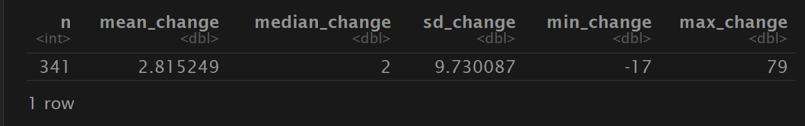

Utifra t-testen finner vi ut at sentralitetsindeksen fra 2020 til 2023 har ikke så store endringer.
Vi har med 341 kommuner, og i gjennomsnitt har indeksen økt med ca.
2,8 poeng.
Medianen er 2 som betyr at for de fleste kommunene er endringen veldig liten.
Det er likevel noen kommuner som skiller seg ut, der den største nedgangen er -17 og den største økningen er 79.
Totalt sett tyder dette på at sentraliteten er ganske stabil i perioden, men med noen få unntak.
Alt i alt virker det som at sentralitetsmønsteret ikke har endret seg noe særlig, og at endringene heller handler om små oppdateringer enn store skift

## Prosentvis arbeidsledighet

NAV og SSB (AKU) måler begge arbeidsledighet, men de gjør det på forksjellige måter.

NAV måler arbeidsledigheten utifra hvor mange som er registrert som helt arbeidsledige hos NAV.
Dataen til NAV bygger seg dermed opp på grunnlag av hvem som har meldt seg arbeidsledig i NAV-systemet.
NAV sine tall er avhengige av at arbeidsledige registrerte ledigeheten sin.
De blir og indirekte påvirket av hvilke regler som gjelder for å få hjelp (dagpenger) og at man må holde registreringen aktiv (fornye/holde registrering aktiv).

SSB sine tall kommer derimot fra AKU (Arbeidskraftundersøkelsen), som er en spørreundersøkelse der et utvalg av befolkningen blir intervjuet.
AKU måler arbeidsledigheten i hele befolkningen, Dette gjelder også personer som ikke er registrert hos NAV.
I AKU blir man regnet som arbeidsledig dersom man er uten jobb, har søkt jobb og er tilgjengelig for arbeid.

Begge disse statistikkene bygger på samme ide om hva arbeidsledighet er, men tallene kan bli forskjellige.
AKU fanger opp arbeidsledige som ikke melder seg hos NAV, og noen som er registrert hos NAV kan i AKU svare slik at de ikke blir klassifisert som arbeidsledige der.
I tillegg kan forskjeller i aldersavgrensning og tidspunktet det måles på bidra til at NAV- og AKU-tallene ikke blir like.

## Sysselsetting

Sysselsettingsdata er hentet fra Statistisk sentralbyrå (SSB), tabell 03321.
Tabellen gir informasjon om antall arbeidsplasser i norske kommuner fra år 2000 og fremover, basert på tall for 4.
kvartal hvert år.
Analysen er avgrenset til sysselsatte personer etter arbeidsstedskommune, og kommuneinndelingen som gjelder i 2026 er benyttet.

Dataene er samlet i en SAS-fil med årlige observasjoner på kommunenivå.
Filen inneholder variablene knr24 (kommunenummer), år, arbeidssted (antall sysselsatte etter arbeidssted), beftot (totalt folketall) og *syss*, som angir sysselsettingsandelen beregnet som forholdet mellom antall sysselsatte og folketallet.

## Boligtyper

For å hente data om boligtyper har vi benyttet tabell 06035, som inneholder data om selveierboliger for delt på regioner.
I datasettet er boligtypene fordelt på tre kategorier, av disse har vi benyttet variablene eneboliger og blokkleiligheter.
Når datasettet ble hentet fra API tjenestene ble "boligtype" satt som variabel, og hvert årstall for hver kommune inneholdt to observasjoner.
Vi omgjorde dette til et "long format" slik at hver av boligtypene ble egne variabler.
Denne omformateringen gjorde dataset enklere å jobbe med og halverte hvor mange celler det inneholdt.
Tidsserien for datasettet er fra 2002 til 2024.

## Utdanningsnivå

For å finne utdanningsnivå har vi brukt tabellen 09429.
Denne tabellen har ikke oppdaterte data for nye kommuner per 2024.
Vi måtte derfor hente ut alle kommunene og så sortere etter de nye kommunenavnene ved å bruke "newknr".
Videre hentet vi ut data for begge kjønn og hentet ut bare høyere utdanning da det er det oppgaven krever.
Dataene var delt inn i "Universitets- og høgskolenivå, kort" og "Universitets- og høgskolenivå, lang", disse har vi slått sammen.
Vi har filtrert vekk data for hele landet samlet, samt de utdanningsnivåene som ikke var relevant.
For å regne ut andelen har vi brukt de nye kommunenummerene og total befolkning.

## Ut- og innflyttninger

Videre har vi hentet data om innenlands flytting fra SSB sin tabell 13255 ved hjelp av PxWeb API. Vi hentet ut data for alle kommuner, fordelt på aldersgruppene 18–29 år og 30+ år, for perioden 2010–2024.

Deretter bruker vi `newknr`, slik at alle observasjoner ble koblet til dagens kommunestruktur (knr24).
Vi fjernet ugyldige og aggregerte enheter, og summerte inn- og utflytting per kommune, år og aldersgruppe.
Nettoflytting ble så beregnet som differansen mellom innflytting og utflytting, og manglende verdier ble satt til null for å unngå skjevheter i beregningene.

For å gjøre kommunene sammenlignbare beregnet vi nettoflytting per 1000 innbyggere for 2024 ved å koble dataene med totalbefolkningen (beftot).
Dette gir oss en rate som gjør det mulig å sammenligne flyttemønstre mellom små og store kommuner, samt mellom de to aldersgruppene.
Samlet gir dette et konsistent og sammenlignbart mål på demografisk utvikling og flytting på kommunenivå.

# Litteratur

## Regional utvikling i Norge

@andersson2019 har skrevet en artikkel om utviklingen i Norge fra 1970 til 2017.De undersøker de hvordan arbeidsledighet, sysselsetting og boligpriser varierer mellom steder og om det fører til mer sentralisering.Videre undersøker også om forholdet mellom arbeidsmarked og befolkningsvekst kan forklare regionale forskjeller.

Resultatene viser at det har vært en var en høy befolkningsvekst i små kommuner fra 1970 til 1980, etter det har befolkningsveksten vært sterkest i de store kommunene [@andersson2019].
Dette er det samme som @thorsnæs2025 skriver om befolkningsutvikling.
Undersøkelsen til @andersson2019 viser at sentralisering hovedsakelig skjer *innenfor* arbeidsmarkedsregioner, ikke mellom dem.
Kommuner uten økonomiske utfordringer har hatt sterkest vekst, mens kommuner med høy arbeidsledighet og lave boligpriser har opplevd både færre jobber per innbygger og befolkningsnedgang [@andersson2019].

Det finnes få tegn til økonomisk konvergens mellom regioner i Norge, i motsetning til mange andre europeiske land.
Sentralisering har vært særlig sterk i perioder med økonomisk oppgang, mens utviklingen var mer dempet i 70‑ og 80‑tallets svakere konjunkturer.
Undersøkelsen peker også på at migrasjon, utdanningsnivå, demografi og boligmarked spiller viktige roller i å forme regionale forskjeller [@andersson2019].

@regionalutvikling2025 gir en overordnet framstilling av hvordan demografiske, økonomiske og geografiske prosesser former utviklingen i norske kommuner.
Rapporten beskriver et Norge der regionale forskjeller fortsatt er tydelige, og der utviklingen i stor grad følger et mønster som skiller sentrale områder fra mer perifere deler av landet.
Befolkningsvekst, arbeidsplasskonsentrasjon, utdanningsnivå og boligmarkedets dynamikk samler seg i økende grad i og rundt de største byene.
Dette skaper sterke regionale tyngdepunkt som tiltrekker seg både mennesker og arbiedsplasser.
Samtidig står mange distriktskommuner overfor helt andre utfordringer.
De preges ofte av en aldrende befolkning, svakere utvikling i arbeidsmarkedet og en vedvarende utflytting av unge voksne.

Samtidig løftes betydningen av mobilitet fram son en nøkkel til å forstå regionale sammenhenger.
Flytting og pendling binder kommuner sammen i større funksjonelle regioner, og endringer i ett område kan få konsekvenser for både nabokommuner og større arbeidsmarkedsregioner.
Rapporten viser også at utdanningsnivået stiger i hele landet, men at veksten er sterkest i de mest sentrale kommunene, noe som igjen påvirker både arbeidsmarkedet, inntektsnivå og boligpriser.

Gjennom sin brede tilnærming gir *Regionale utviklingstrekk 2025* et helhetlig bilde av de strukturelle kreftene som driver regional utvikling i Norge.
Rapporten fungerer som et viktig kunnskapsgrunnlag for analyser som undersøker systematiske variasjoner mellom kommuner.
Den gir samtidig et tydelig rammeverk for å forstå hvordan sentralitet, demografi, arbeidsmarked og mobilitet utvikler seg og påvirker hverandre over tid.

@johansenonsager2017 gir en bred framstilling av hvordan befolkning, arbeidsplasser og økonomisk aktivitet gradvis har konsentrert seg i byer og tettsteder.
Utviklingen beskrives som en langsiktig prosess der urbanisering, arbeidsinnvandring og høyt aktivitetsnivå både privat og offentlig sektor har bidratt til sterk vekst i mange byregioner.
Samtidig viser artikkelen at Norge skiller seg fra mer urbaniserte europeiske land gjennom en småskala bystrukturer som likevel har lagt grunnlag for høy verdiskaping og produktivitet i store deler av landet.
Det pekes også på betydelige nyanser i utviklingen, der enkelte mindre byregioner og distriktsområder har hatt positiv vekst, mens andre har opplevd stagnasjon eller tilbakegang.

Artikkelen løfter fram hvordan næringsstruktur, innovasjonsevne og regional arbeidsdeling påvirker verdiskaping og sysselsetting.
Den viser også hvordan sentrale og perifere områder er tett knyttet sammen gjennom kunnskapsutveksling, verdikjeder og pendling.
Samlet gir artikkelen et heletlig bilde av de strukturelle kreftene bak regional utvikling i Norge.
Den tydeliggjør samtidig hvordan sentralisering og regionale forskjeller formes av økonomiske, demografiske og institusjonelle forhold.

@vareide2024 har skrevet en fagfellevurdert bok om regional utvikling i Norge og hvordan ulike steder kan påvirke sin egen vekst.
Boka undersøker hvorfor noen kommuner og regioner vokser, mens andre opplever stagnasjon eller befolkningsnedgang.
Et sentralt bidrag i arbeidet er utviklingen av den såkalte *attraktivitetsmodellen*, som forklarer vekst gjennom samspillet mellom arbeidsplassutvikling, flyttemønstre og steders attraktivitet.
Vareide skiller mellom strukturelle forhold som steder i liten grad kan påvirke (som sentralitet og næringskultur), og lokale faktorer som kan påvirkes gjennom politikk og utviklingsarbeid.

Videre vider analysene at sentralisering i Norge i stor grad drives av flyttemønstre der mennesker foretrekker å bosette seg mer sentralt, og at dette igjen skaper indirekte vekst i arbeidsplasser i sentrale område.
Boka finner at økonomisk vekst i stor grad følger av befolkningsutvikling, heller enn omvendt, og at bostedspreferanser spiller en viktig rolle i regionale forskjeller.
@vareide2024 peker også på at faktorer som demografi, boligmarked, tilgjengelighet til arbeidsplasser og sentralitet har stor betydning for utviklingen, mens enkelte vanlige forklaringer som utdanningsnivå og innovasjonsgrad i næringslivet har svakere sammenheng med regional vekst enn ofte antatt.

## Budrenteteori

Budrenteteorien gir et sentralt analytisk rammeverk for å forstå hvordan geografisk plassering påvirker arealbruk og boligpriser [@capello2016].
Ifølge teorien faller betalingsvilligheten for bolig med økende avstand til sentrum eller sentrale arbeidsmarkeder, fordi tilgjengelighet påvirker både tidsbruk og økonomiske kostnader knyttet til daglige aktiviteter.
Sentrale beliggenheter gir bedre tilgang til arbeidsplasser, markeder og tjenester, og dette gir høyere areal- og boligpriser.
Dermed oppstår systematiske romlige forskjeller i boligmarkedet som reflekterer forskjeller i tilgjengelighet.

Denne mekanismen nyanseres av @osland2008 , som viser at boligpriser ikke bare påvirkes av fysisk avstand til sentrum, men også av regional arbeidsmarkedstilgjenglighet.
Ved å introdusere en gravitasjonsbasert tilgjengelighetsindikator finner de at både en "urban attraction"-effekt og en arbeidsmarkedseffekt bidrar til å forklare romlige variasjoner i boligpriser.
Dette innebærer at sentralitet kan forstås som et uttrykk for samlet tilgang til arbeidsplasser og tjenester, og at slike strukturelle forhold kan forsterke sentraliseringsprosesser [@osland2008].

## Harris-Todaro modellen

En modell som sier noe om hvorfor personer flytter til byen selv om det er høy arbeidsledighet.
Det handler om at selv om det ikke finnes jobber i byen så vil det lønne seg på sikt.
Muligheten for jobb er større i større byer enn i mer rurale strøk fordi behovet for arbeidskraft er større.
Dette fører også til at store byer ofte har en konstant høy arbeidsledighet.
Modellen har fått kritikk for å være for enkel, den legger til grunn at det er bare lønn som bestemmer om man er villig til å flytte [@harris1970].

## Vekst i Norge

Det er forsket på hva som avgjør at noen byer vokser raskere enn andre.
Forskningen peker på to hovedforklaringer.
Den ene er at byer med offshorevirksomhet eller andre naturessursbaserte virksomheter som fisk kraft som har gitt en høyere produksjonsvekst enn andre byer [@grünfeld2016].

Den andre hovedforklaringen de peker på er utdanningsnivået til arbeidsstyrken.
De ser at byene som har kunnskapsintensive næringer har også en høy andel utdannede mennesker og er de byene som vokser mest.
Videre ser de at det er byer med store næringer, men som ikke vokser så mye, og peker på at lav utdanningsnivå kan være årsaken til det. De mener sysselsettingsvekst og utfanningsnivå har en sammenheng.
Videre ser de at byene som Gjøvik, Kongsvinger og Notodden som ligger relativt nærme Oslo, sliter med at de ligger for langt unna til å nyte godt av storbydfordelene, samtidig taper de folk til byen.
Utdanningsnivået er også lavere her.
De konkluderer med at utdanning er viktig for steders vekst [@grünfeld2016].

# Visuell fremstilling av utviklingen i Norge etter 1986

## Folketallsutvikling


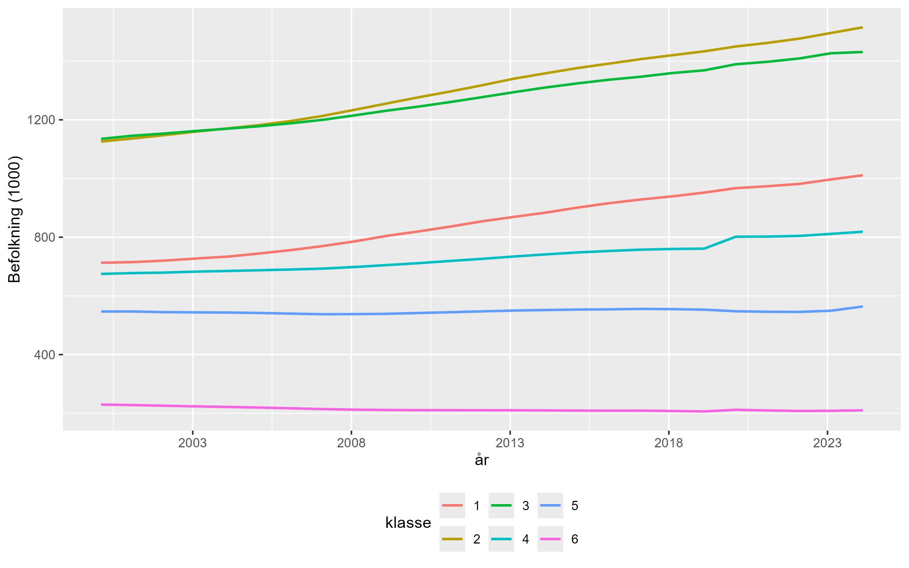{#fig-nsvnovbre}

Kartet viser prosentvis folketallsvekst i norske kommuner etter år 2000.
Mange kommuner har hatt nedgang i folketallet, særlig de som ligger langt fra større byer og derfor regnes som mindre sentrale.
Dette er det samme som @andersson2019 og @regionalutvikling2025 har beskrevet i sine arbeid.

Grafene er delt inn i sentralitetsklassene fra 1 til 6, der klasse 1 er mest sentral og klasse 6 minst.
Vi ser at kommunene med sterk grønnfarge er de største byene i Norge og områdene rundt dem.
Videre har mindre byer også grønn farge, men i svakere nyanser.
Dette gjenspeiles i grafen, der klasse 1, 2 og 3 har hatt den sterkeste veksten, klasse 4 har hatt noe vekst, mens klasse 5 har hatt en mer svingende utvikling.

### Befolkningsutvikling 20-29

{width="80%"}

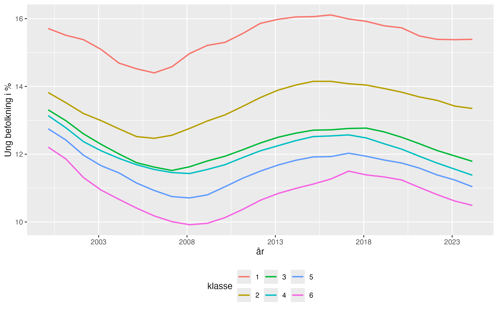

Kartet viser andelen av befolkningen i aldersgruppen 20-29 år i norske kommuner for året 2024.
De mørkeste lilla nyansene markerer kommuner med høyest andel unge voksne, som for eksempel Rena, Bardu og Målselv.
Dette kan henge sammen med tilstedeværelsen av store militærbaser i disse områdene.
Også kommuner med store byer og gode studiemuligheter har en høy andel unge, noe som understreker betydningen av utdanningstilbud og arbeidsmuligheter.

Vi ser naturlige svingninger i kurvene, som kan skyldes variasjoner i fødselstall.
I 2024 har klasse 1 og 2 den høyesre andelen unge, noe som samsvarer med det vi ser på kartet.
Det som er interessant, er at kommuner med militærbaser, til tross for sin høye andel unge, ikke skiller seg ut på grafen.
Dette kan skyldes at disse kommunene inngår i klasser med mange andre kommuner, slik at det ikke får like stor visuell betydning i grafen.

### Prosentvis arbeidsledighet


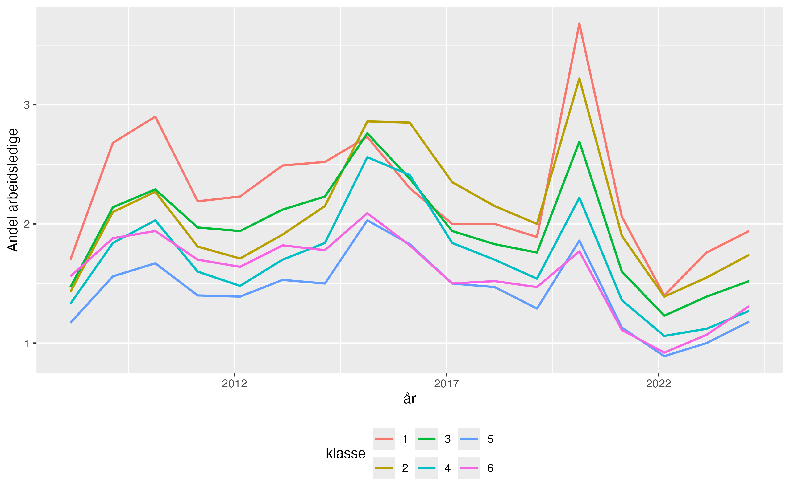

Sammenlignet med tidligere kart er det vanskeligere å se tydelige mønstre, men enkelte områder skiller seg ut.
I Finnmark ser vi flere kommuner med sterk rosa farge, som indikerer høy arbeidsledighet.
Det samme gjelder deler av Østlandet.
En svakhet ved kartet er at det inneholder mange klasser med korte intervaller.
Dette gjør det utfordrende å skille fargene fra hverandre og dermed tolke dataene visuelt.

Grafen viser at arbeidsledigheten har variert fra år til år, med et tydelig hopp i 2020 da koronapandemien førte til nedstengning av samfunnet.
Allerede i 2021 ser vi at arbeidsledigheten sank igjen, noe som kan tyde på en relativ rask økonomisk gjenoppretting.
Vi ser at de mest sentrale klassene har jevnt over høyest arbeidsledighet.
Årsaken kan være at det vil lønne seg på sikt å flytte til store byer grunnet store mulighetene, og dermed har de konstant høy arbeidsledighet slik som Harris-Todaro modellen beskriver [@harris1970].

### Sysselsettingsvekst


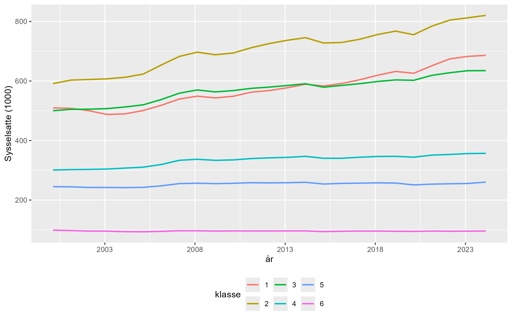

Generelt ser vi at det er flest grønne kommuner, og de med sterkest grønnfarge er typisk kommuner med større byer og mer sentral beliggenhet.
Grafen viser at klasse 1 og 2 har hatt den sterkeste veksten, mens klasse 6 er den eneste med negativ utvikling.
Dette samsvarer med det vi ser på kartet, og understreker hvordan sentralitet henger sammen med arbeidsmarkedet.
I litteraturen har vi sett at regioner med sysselsettingsvekst og høy arbeidsledighet, samt høye boligpriser er de regionene som vokser mest.
Dette har vi sett at gjelder for våre kart også.

Når vi sammenligner grafen for sysselsetting med grafen for folketallsvekst, ser vi at utviklingen er svært lik.
Dette kan tyde på at befolkningsvekst og sysselsettingsvekst ofte går hånd i hånd.
Dette er noe vi skal se nærmere på senere.

### Kvmpris utvikling


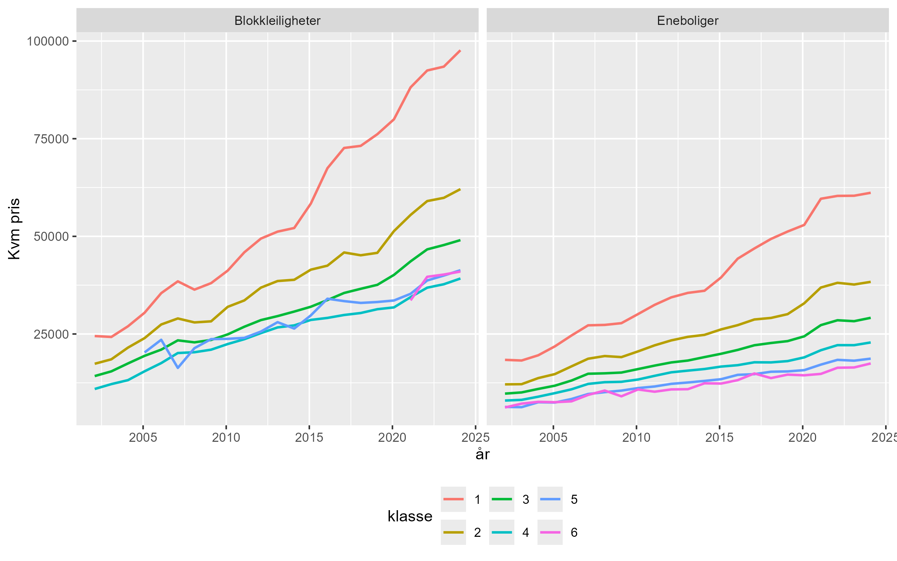

Vi har valgt å lage kart kun for eneboliger, siden leiligheter hadde mange manglende verdier, særlig i kommuner uten byer.
Dette skyldes lavt antall omsatte leiligheter, og ifølge SSB må et visst antall transaksjoner gjennomføres før tallene vises.
Derfor gir grafene et bedre bilde av utviklingen, spesielt for leiligheter, der vi ser en kraftig vekst i kvadratmeterpris de siste årene.
Det er først nylig at det finnes nok data til å vise utviklingen for klasse 6.
For eneboliger ser vi også en tydelig prisvekst i alle klasser.

Kartet for 2024 viser at de høyeste boligprisene finnes i de største byene.
Dette henger sammen med faktorer som befolkningstetthet, utdanningsnivå og flyttemønstre.
De største byene fremstår som mest attraktive, noe som gjenspeiles i både prisnivå og utvikling over tid.
Vi ser også at det kommuner nærliggende byer har også høyt prisnivå, det kan skyldes at prisene presses så høyt at man velger å flytte lengre vekk fra sentrum, da vil prisene der også presses opp.
Når vi ser på intervallene for kvmpriser på kartet så ser vi også at prisforskjellene er veldig store fra bygd til by.

Mønsteret i kartet for kvadratmeterpris kan forklares med budrenteteorien.
De høyeste boligprisene finner vi i de største byene og mest sentrale kommunene, noe som indikerer at sentrale beliggenheter verdsettes høyere i boligmarkedet.
Prisforskjellene kan dermed knyttes til variasjoner i tilgjengelighet til arbeidsmarkedet og den generelle attraktiviteten ved sentrale lokaliseringer.

### Utdanning utvikling


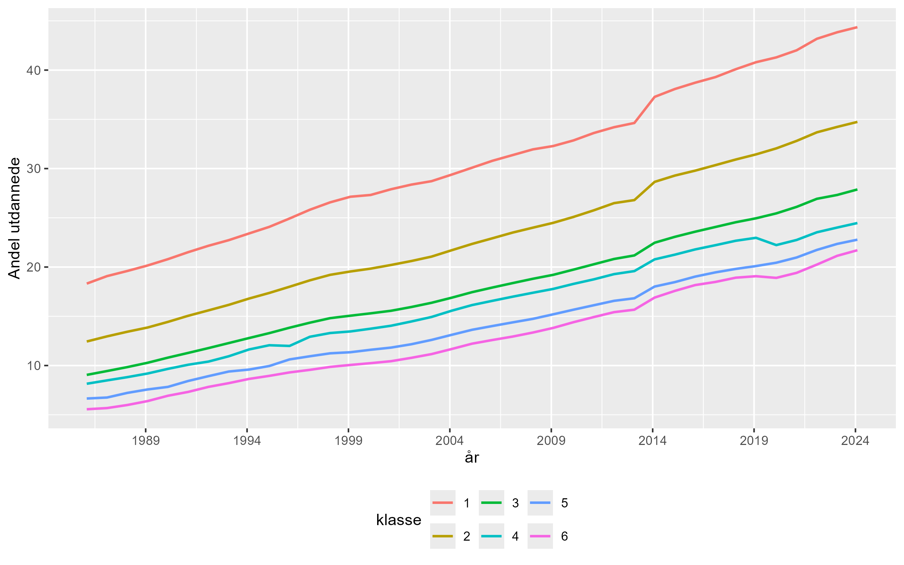

Kartet viser andelen innbyggere med høyere utdanning i norske kommuner i 2024.
Kommunene med mørkest rødfarge har den største andelen med høy utdannede.
Dette gjelder særlig de største studiebyene i Norge, som Oslo, Bergen og Trondheim.
Det kan forklares av at kunnskapsintensive bransjer vokser.
Kommunene som ligger rundt disse byene har noe lavere andel, men fortsatt høyere enn kommuner som ligger lenger unna.
Dette kan skyldes at personer som bor i nabokommuner har tatt høyere utdanning i nærliggende kommune, og dermed bidrar til å løfte utdanningsnivået også i sin egen kommune.
Forskningen peker på at byer som ligger i nærheten av storbyer, men ikke nært nok til at byene får nyte godene av storbyen, har også lavt utdanningsnivå.
I tillegg at til byer med kunnskapsintesive bransjer med høyt utdanningsnivå vokser mest.
Et eksempel fra artikkelen de trekker frem er Haugesund [@grünfeld2016].
På kartet ser det ut som at Haugesund har en høy andel med høyt utdannede.
De har også en stor sysselsettingvekst.

Grafen viser utviklingen i andelen med høyere utdanning fra 1986 til 2024.
Vi ser en tydelig og jevn vekst i alle sentralitetsklasser, noe som kan forklares med økt fokus på utdanning og et samfunn som stiller stadig høyere kompetansekrav.

### Flytting utvikling


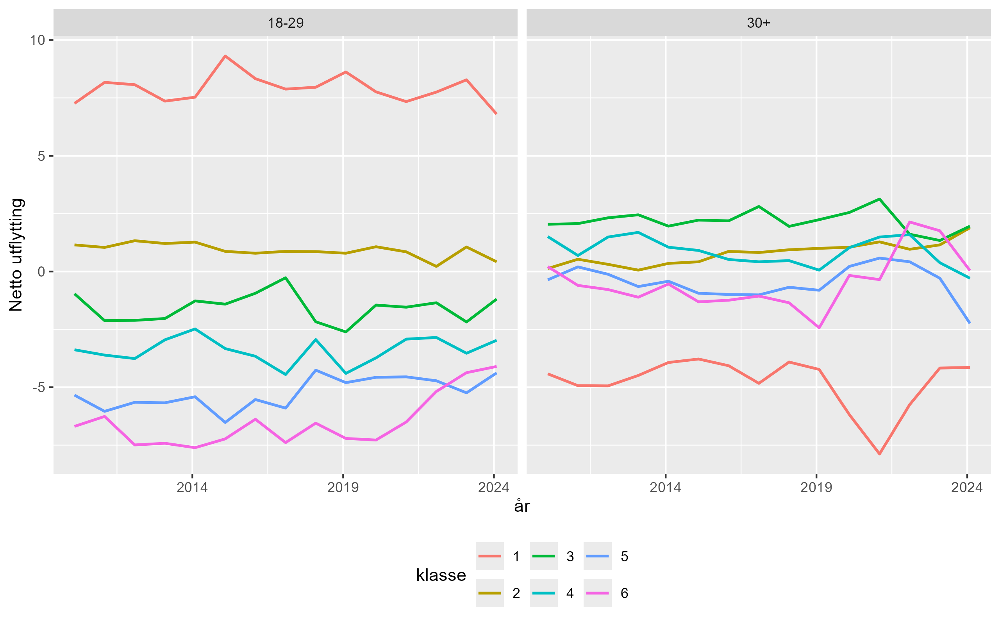

For flytting har vi delt kart og grafer inn i to aldersgrupper, 18-29 og 30+.
Her ser vi tydelig forskjeller i flyttemønstre mellom de to gruppene.
På kartene er kommuner med netto innflytting markert i blått, mens kommuner med netto utflytting vises i rødt.
Kartet for den yngre befolkningen viser en klar trend der unge flytter fra små bygdekommuner til byene, sannsynligvis for å studere eller jobbe.
Unge mennesker er kanskje mer opptatt av å ha mange muligheter for jobb og lønn Harris-Todaro modellen beskriver at man er villig til å flytte til store byer selvom arbeidsledigheten er stor, fordi lønnsmulighetene er større på sikt [@harris1970].
Når man blir eldre, ser vi at mange flytter tilbake til bygdene, kanskje for å etablere familie.

Grafene gjenspeiler dette mønsteret, klasse 1 har høy netto innflytting blant unge, men negativ nettoflytting blant dem over 30 år.
I 2021 ser vi en tydelig dupp i flyttingen for den eldre aldersgruppen.
Dette kan sannsynligvis henge sammen med koronapandemien.
Det er også en liten nedgang blant de unge samme år, men den er langt mindre.
Hvorfor skjer dette?

For de øvrige klassene ser vi noen svingninger, men generelt er utviklingen stabil.
Dette understreker hvordan alder og livsfase påvirker hvor folk velger å bo.

### Pendling utvikling


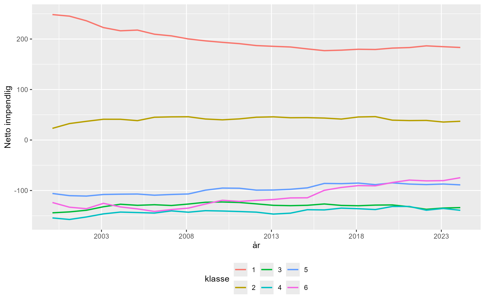

Kartet viser netto innpendling per 1000 arbeidsplasser i kommunene.
Vi ser at det er få kommuner med sterk negativ netto innpedling, og disse er spredt rundt på Østlandet.
Samtidig ser vi at flere av kommunene med en positiv netto innpendling ligger i nærheten av de rød kommunene.
Dette kan tyde på at mange pendler fra de rød kommunene og inn til de mørkeblå kommunene, som da bidrar til høy netto innpendling i de blå kommunene.
Det kan være sannsynlig at mange som bor i kommunene rundt Oslo kommune, jobber i og pendler inn til Oslo.

Grafen viser utviklingen i netto innpendling fra år 2000 til 2024.
Her ser vi at sentralitetsklassene 2 til 6 har hatt noen svingninger, men viser en positiv utvikling over tid.
Klasse 1, som representerer Oslo, har derimot hatt en negativ utvikling i netto innpendling.
Dette kan skyldes at flere mindre kommuner i andre klasser har blitt mer attraktive og sentrale som arbeidssteder, noe som har redusert innpendlingen til Oslo over tid.

Budrenteteorien kan bidra til å belyse pendlemønstrene vi observerer.
Når boligprisene er høye i sentrale kommuner, ser vi at mange husholdninger bosetter seg i omlandskommuner med lavere boligkostnader, samtidig som arbeidsplassen beholdes i sentrum.
Dette gir høy netto innpendling til de mest sentrale kommunene og netto utpendling fra omkringliggende kommuner.
Pendlingen kan dermed forstås som et uttrykk for romlige tilpasninger i møte med forskjeller i boligkostnader og tilgjengelighet til arbeidsplasser.

# Korrelasjonsberegninger

## Korelasjon mellom gitte variabler

Som første deskriptive tilnærming presenteres korrelasjonsberegninger på utvalgte variabler.
Korrelasjonen er beregnet for alle de norske kommuner i årene 2014 og 2024.
Korelasjonsverdien er en indikator på graden av samvariasjon mellom to gitte variabler.
Skalen for korelasjon går fra -1 til 1.
Jo nærmere 1 et positivt tall er, jo større tyder på det på en positiv samvariasjon, og vice versa med negative tall.

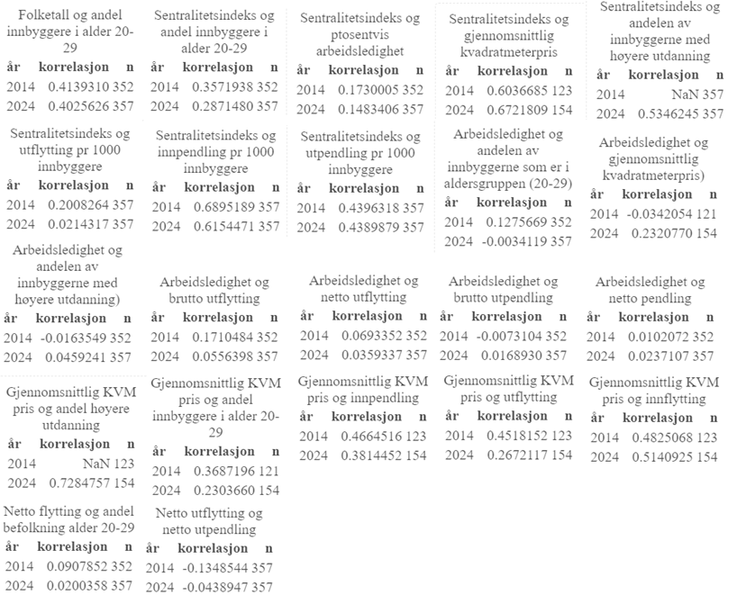

## Paneldata

I paneldata analysen beregnes korrelasjoner basert på årlige endinger innen hver kommuner.
Dette skiller seg fra forrige avsnitt hvor nivåforskjellene ble målt mellom kommuner.

Først er det blitt beregnet Spearman korrelasjonskoefisienter, utifra dette datasettet med delta verdier.

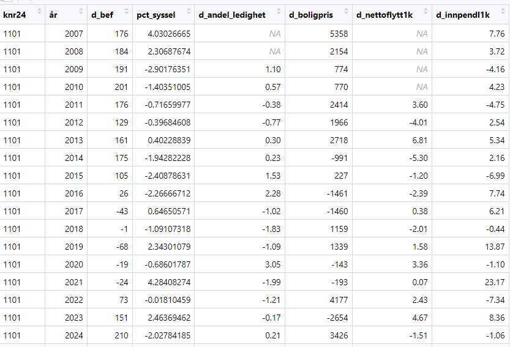

Ettersom det er veldig mange kommuner er det lite hensiktsmessig å illustrere hver enkelt kommune sine samvariasjoner.
Derfor illustreres et "summary" av hver av de enkelt variabelkombinasjonene

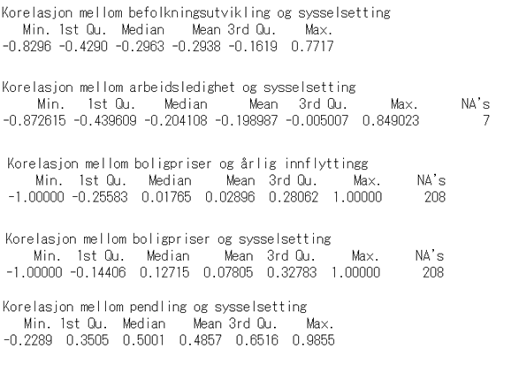

### Trege virkninger

Trege virkninger er når en variabels endring ikke nødvendigvis utløser en endring i en annen variabel umiddelbart.
Selv om det kan observeres en sammenheng mellom utviklingen i boligpriser og utflytting i en kommune, er det ikke gitt at effekten viser seg i samme år.
 For å fange opp disse effektene, kan «laggede variabler» benyttes.
Da tester man ikke for korrelasjoner mellom to variabler observert i samme år, men tester en variabel opp mot observasjoner fra en annen periode. 
Da kan man for eksempel teste hypoteser som at en endring i boligpriser vil påvirke netto innflytting det påkommende året.

Dette er et viktig aspekt for å unngå at faktiske sammenhenger blir oversett fordi effekten ikke spiller inn med en gang.

I denne oppgaven for å teste denne effekten lager vi et nytt datasett hvor en av variablene brukes fra året før, for å se forskjellen fra den opprinnelige panel analysen.

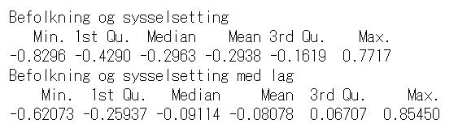

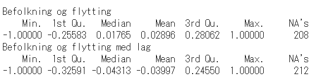

Pearson-korrelasjonen måler lineær samvariasjon mellom to kontinuerlige variabler, og er følsom for ekstreme verdier.
Spearman-korrelasjonen er basert på rangering av observasjoner, og fanger opp monotone sammenhenger, også når forholdet ikke er lineært.

Pearson koeffisient måler for liner samvariasjon mellom to kontinuerlige variabler, mens Spearman baserer seg på en rangering av observasjoner.
De har hver sin styrke, hvor Pearson er svært følsom for ekstreme verdier, mens Spearman heller fanger opp monotone sammenhenger, også ved ikke livnære sammenhenger.

## Spredningsdiagrammer

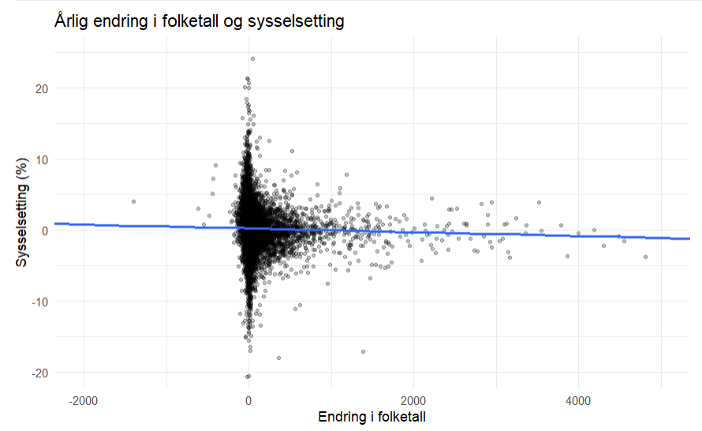

Spredningdiagrammet viser en svak negativ sammenheng mellom årlig endring i folketall og sysselsetting.
Dette indikerer at kommuner med befolkningsvekst ikke nødvendigvis opplever tilsvarende vekst i lokale arbeidsplasser, noe som kan reflektere økt pendling eller konsentrasjon av arbeidsplasser i større regionale sentre.
Samtidig er spredningen stor, noe som tyder på at andre faktorer enn befolkningsendring spiller en viktig rolle for sysselsettingsutviklingen.

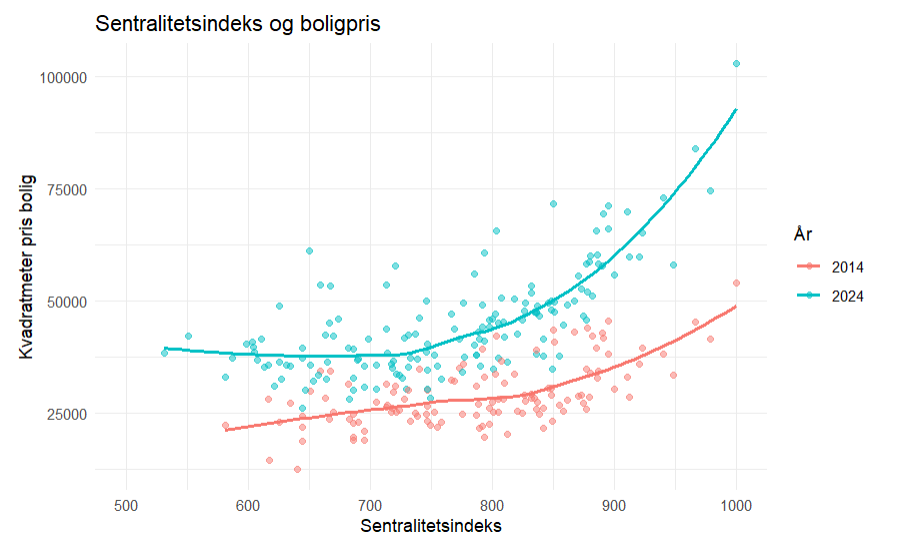

Spredningdiagrammet viser en tydelig positiv sammenheng mellom sentralitetsindeks og boligpris, men relasjonen fremstår ikke lineær.
Boligprisene øker relativt moderat ved lave nivåer av sentralitet, men sterkere i de mest sentrale kommunene.
Dette tilsier at Spearman-korrelasjonen kan gi et mer robust mål på sammenhengen enn Pearson, ettersom Spearman ikke forutsetter lineæritet.

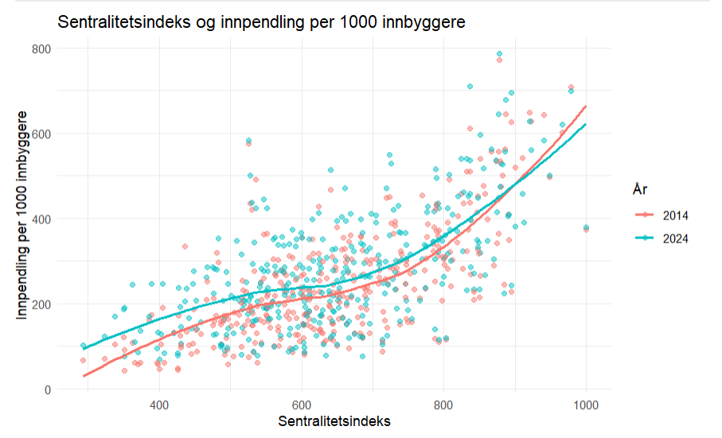

Spredningdiagrammet viser at sammenhengen mellom sentralitetsindeks og innpendling er monotont økende, men ikke fullt ut lineær.
Innpendlingen øker relativt svakt ved lave nivåer av sentralitet, men mer markant i de mest sentrale kommunene.
Dette innebærer at Pearson-korrelasjonen, som forutsetter lineæritet, kan undervurdere styrken i sammenhengen, mens Spearman-korrelasjonen er bedre egnet til å fange den monotone strukturen i dataene.
Selv om sammenhengen er tydelig, viser spredningen i punktene at sentralitet alene ikke forklarer variasjonen i innpendling, og andre faktorer som næringsstruktur og transporttilgang spiller også en rolle.

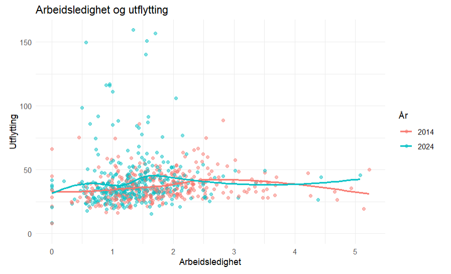

Spredningdiagrammet mellom arbeidsledighet og utflytting viser ingen klar systematisk sammenheng noe som samsvarer med korrelasjonskoeffisientene på 0.06 og 0.02 for de to årene.
Den glatte kurven er tilnærmet flat, og punktene er spredt uten et tydelig mønster.
Dette illustrerer en viktig begrensning ved korrelasjonskoeffisienter: selv når de kan beregnes, gir de lite informasjon dersom det ikke foreligger en tydelig strukturell sammenheng mellom variablene.

# Sammenheng mellom befolkning og sysselsetting

```{r}
regresjonTest <- lm(formula = Arbeidssted ~ beftot, data = regresjon)

summary(regresjonTest)
```

```{r}
regresjonTest <- lm(formula = beftot ~ Arbeidssted, data = regresjon)

summary(regresjonTest)
```

```{r}
regresjon_fe <- plm(
  Arbeidssted ~ beftot,
  data = regresjon,
  index = c("knr24", "år"),
  model = "within",
  effect = "twoways"
)

summary(regresjon_fe)
```

Vi har kjørt en regresjon som viser sammenhengen mellom befolkning og sysselsetting for norske kommuner.
Der vi byttet på befolkning og sysselsetting som avhengig variabel.
I begge regresjonene er det en svært høy justert r-kvadrert.
Det vil si at man ikke kan tolke resultatene kausalt.
Man kan ikke bestemme hva som begrunnes av hva.

Videre forsøkte vi å sette kommune og år som fast effekt for å se om resultatene endret seg noe.
Da ser vi at justert r-kvadrat er litt lavere, men fortsatt veldig høy.
Det betyr også at vi ikke kan tolke resultatene kausalt.

Tidligere så vi på kurver for befolkningsutvikling og sysselsetting, der så vi at kurvene hadde en lik utvikling, noe som tyder på at de henger sammen.
Det ser vi igjen her at forklaringsgraden er veldig høy.
Men det forklarer ikke om sysselsetningen øker hvis befolkningen øker, eller omvendt.
Man kan derfor ikke tolke det kausalt.

```{r}
regresjon |> 
  select(beftot, Arbeidssted) |> 
  cor() 
```

For å regne ut korrelasjonen har vi brukt antall sysselsatte og antall i befolkning.
Korrelasjonen er veldig sterk, verdien er veldig lik som på den justerte r-kvadraten som vi så på regresjonen vår.
Det betyr at man ikke kan tolke resultatene kausalt og det er fare for at det er multikollinearitet til stede.

For å få et mer hensiktsmessig resultat kunne vi hatt andel sysselsatte eller sett på atbeidsplass per 1000 innbyggere, slik at man hadde sett verdiene i forhold til hverandre.

# Relevante hypoteser basert på deskriptiv statistikk

Så langt gjennom denne oppgaven er det blitt presentert mye deskriptiv statistikk knyttet til regional utvikling.
Samlet sett gir dette et godt grunnlag for hypoteser for hvordan ulike variabler henger sammen.

I oppgave 3 fant vi en positiv korrelasjonskoeffisient på om lag 0,42 mellom sentralitetsindeksen og befolkningsvekst.
Dette indikerer en moderat positiv sammenheng og gir empirisk støtte til hypotesen om at kommuner med høy sentralitet i større grad opplever befolkningsvekst enn mindre sentrale kommuner.

Hypotesen kan underbygges teoretisk gjennom agglomerasjonsteori.
Agglomerasjonseffekter beskriver hvordan bedrifter og arbeidstakere har insentiver til å lokalisere seg i samme geografiske områder.
Bedrifter etablerer seg i sentrale områder for å dra nytte av såkalte “matching, sharing og learning”-fordeler.
Dette innebærer bedre match mellom arbeidsgivere og arbeidstakere, deling av infrastruktur og tjenester, samt kunnskapsspredning mellom aktører @capello2016 s.3.

I sentrale områder oppstår det større og mer diversifiserte arbeidsmarkeder, med høyere grad av spesialisering.
Dette reduserer risikoen for arbeidstakere og øker sannsynligheten for å finne relevant arbeid, noe som igjen gjør slike områder mer attraktive.
Resultatet kan bli en selvforsterkende vekstprosess der flere arbeidsplasser tiltrekker flere innbyggere, som igjen skaper grunnlag for ytterligere næringsaktivitet.

Grafen over befolkningsutvikling etter sentralitetsklasse fra oppgave 2 gir ytterligere støtte til denne mekanismen.
Kommuner i sentralitetsklasse 1, 2 og 3 viser en tydelig og markant vekst gjennom perioden.
Klasse 4 viser også økning, men i et mer moderat tempo.
De minst sentrale kommunene har gjennomgående flat utvikling, og klasse 6 har samlet sett opplevd befolkningsnedgang.
Dette mønsteret er konsistent med hypotesen om at høyere sentralitet er forbundet med sterkere befolkningsvekst.

En annen relevant problemstilling er sammenhengen mellom andelen av befolkningen i aldersgruppen 20–29 år og kommunens netto utflytting.
Hypotesen er at kommuner med lav andel unge voksne i større grad opplever netto utflytting enn kommuner med høyere andel i denne aldersgruppen.

Korrelasjonsberegningene for 2014 og 2024 viser imidlertid en svært svak positiv samvariasjon mellom variablene.
Dette gir ikke empirisk støtte til en sterk lineær sammenheng.
Resultatet indikerer at variasjon i andelen 20–29 år alene i liten grad forklarer forskjeller i netto utflytting mellom kommuner.

Selv om den statistiske sammenhengen er svak, finnes det teoretiske mekanismer som tilsier at relasjonen kan være kompleks.
Aldersgruppen 20–29 år er den mest mobile i befolkningen.
I denne fasen av livsløpet er tilknytningen til hjemstedet ofte svakere, og mange flytter for utdanning eller arbeid.
Kommuner med attraktive utdanningsinstitusjoner og brede arbeidsmarkeder fremstår derfor som særlig attraktive for denne gruppen.

Dersom en kommune over tid har lav andel unge voksne, kan dette være et resultat av tidligere utflytting etter videregående opplæring.
Samtidig kan nettoflytting som indikator skjule betydelig brutto mobilitet, ettersom både inn- og utflytting kan være høy uten at nettoen blir stor.

Kartene over netto flytting og andel unge viser at særlig kommuner på Vestlandet og Østlandet, inkludert Oslo-området, har hatt positiv netto innflytting og samtidig relativt høy andel unge voksne.
Dette kan indikere at sentrale arbeids- og utdanningsmarkeder tiltrekker unge.
I mer perifere områder kan utflytting av unge bidra til en aldrende befolkningssammensetning.

Samtidig finnes det unntak.
I enkelte nordnorske kommuner er andelen unge relativt høy, delvis som følge av militær tilstedeværelse.
Dette illustrerer at strukturelle forhold kan påvirke alderssammensetningen uavhengig av tradisjonelle migrasjonsmekanismer.

Samlet sett tyder analysen på at sammenhengen mellom andelen 20–29 år og netto utflytting ikke er entydig, og at den påvirkes av både utdanningstilbud, arbeidsmarked, institusjonelle forhold og livsløpsdynamikk.

I likhet med forrige eksempel er sammenhengen mellom arbeidsledighet og netto utflytting et komplekst tema, hvor flere mekanismer kan trekke i ulike retninger.
Korrelasjonsberegningene viser en svak positiv sammenheng mellom variablene, noe som indikerer at høyere arbeidsledighet ikke entydig er forbundet med økt netto utflytting.

Kartene viser at flere av kommunene med relativt høy arbeidsledighet befinner seg på Østlandet og i andre sentrale områder, som samtidig har hatt positiv netto innflytting.
Dette kan ved første øyekast virke motstridende, ettersom tradisjonell arbeidsmarkedsteori tilsier at arbeidstakere flytter fra områder med høy arbeidsledighet til områder med bedre jobbmuligheter.

Teori om arbeidsmarkedsjustering og mobilitet tilsier at arbeidskraft beveger seg mot regioner med høy etterspørsel etter arbeidskraft.
Dette skulle isolert sett tilsi at kommuner med høy arbeidsledighet burde oppleve netto utflytting.
Samtidig kan sentrale arbeidsmarkeder tiltrekke arbeidssøkere selv om ledigheten midlertidig er høy.
Store og diversifiserte arbeidsmarkeder gir større sannsynlighet for å finne en jobb som matcher kompetanse og preferanser @capello2016 s.
155.

Arbeidstakere kan derfor være villige til å akseptere en periode med arbeidsledighet i sentrale områder, dersom forventningen om fremtidige jobbmuligheter er høyere der enn i mindre sentrale kommuner.
I mindre arbeidsmarkeder kan man få jobb raskere, men innenfor et smalere spekter av yrker.
Dette kan særlig være relevant for høyt utdannede og spesialiserte arbeidstakere.

Den norske velferdsmodellen kan også bidra til å forklare dette mønsteret.
Et relativt sterkt sosialt sikkerhetsnett gjør det mulig å være arbeidsledig i en periode uten umiddelbar økonomisk nød, noe som kan redusere insentivet til rask geografisk mobilitet.

Samlet sett indikerer analysen at sammenhengen mellom arbeidsledighet og netto utflytting ikke er entydig, og at sentralitet, arbeidsmarkedsstruktur og institusjonelle forhold påvirker relasjonen.

Kartet over andel med høyere utdanning viser en tydelig konsentrasjon i Oslo- og Akershusområdet, samt i flere kommuner på Sør- og Vestlandet, herunder deler av Vestfold, Telemark, Agder og tidligere Hordaland.

Sammenlignes dette med kartet over prosentvis vekst i sysselsetting siden 2000, ser vi at mange av de samme områdene også har hatt sterk sysselsettingsutvikling.
Dette gir empirisk støtte til hypotesen om en positiv sammenheng mellom utdanningsnivå og sysselsetting.

Søylediagrammene i oppgave 3, fordelt etter sentralitetsgruppe, underbygger også denne sammenhengen.
De mest sentrale kommunene skårer høyest både når det gjelder andel med høyere utdanning og sysselsetting.
Dette kan indikere at kunnskapsintensive arbeidsmarkeder i sentrale områder bidrar til høyere sysselsettingsnivå.

Teoretisk kan sammenhengen forklares gjennom humankapitalteori.
Høyere utdanning øker produktiviteten til arbeidskraften og gjør regioner mer attraktive for kunnskapsintensive virksomheter.
Dette kan bidra til flere arbeidsplasser, høyere verdiskaping og dermed høyere sysselsetting per innbygger.
Samtidig kan det foreligge en selvforsterkende mekanisme, der kommuner med høyt utdanningsnivå tiltrekker seg både bedrifter og nye høyt utdannede arbeidstakere.

Det er imidlertid viktig å være oppmerksom på at sammenhengen også kan påvirkes av sentralitet, næringsstruktur og historiske utviklingsmønstre.
Utdanning kan derfor både være en årsak til og et resultat av høy sysselsetting.

Basert på kartvisualisering og korrelasjonsanalyse forventes det en positiv sammenheng mellom sentralitetsindeks og andelen innbyggere med høyere utdanning.
Kartet viser at kommuner med høy utdanningsandel i stor grad er lokalisert rundt større byregioner og mer sentrale områder, mens perifere kommuner gjennomgående har lavere andeler.
Korrelasjonsanalysen for 2024 viser også en moderat positiv sammenheng (r ≈ 0,53), noe som støtter antakelsen om at mer sentrale kommuner tiltrekker eller utvikler en større andel høyt utdannet arbeidskraft.
Samtidig indikerer den moderate styrken på korrelasjonen at sentralitet ikke alene forklarer variasjonen i utdanningsnivå mellom kommuner, og at andre faktorer som næringsstruktur, utdanningstilbud og demografi også kan spille en rolle.

Basert på kartvisualiseringene av netto innpendling og sysselsettingsvekst etter år 2000, samt korrelasjonsanalysen, kan det forventes en sammenheng mellom netto innpendling og sysselsetting per 1000 innbyggere.
Kommuner med høy netto innpendling, altså områder som tiltrekker arbeidstakere fra omliggende kommuner, kan antas å ha et mer dynamisk arbeidsmarked og dermed høyere sysselsettingsnivå.
Samtidig viser korrelasjonsanalysen svært lave korrelasjonskoeffisienter for både 2014 og 2024 (r ≈ 0,01–0,02), noe som indikerer at sammenhengen i praksis er svak eller fraværende.
Dette kan tyde på at pendling i stor grad reflekterer regionale arbeidsmarkedsstrukturer snarere enn direkte sysselsettingsnivå i den enkelte kommune, og at andre faktorer som næringsstruktur, demografi og geografisk beliggenhet også spiller en viktig rolle.

Basert på kartvisualiseringene av sysselsettingsvekst etter år 2000 og gjennomsnittlig kvadratmeterpris for boliger i 2024, kan det forventes en viss positiv sammenheng mellom sysselsettingsvekst og boligpriser.
Kommuner med sterk sysselsettingsvekst kan antas å oppleve økt etterspørsel etter bolig som følge av arbeidsplassvekst og tilflytting, noe som kan bidra til høyere boligpriser.
Samtidig viser korrelasjonsanalysen at sammenhengen er relativt svak, med stor variasjon mellom kommuner.
Dette tyder på at selv om arbeidsmarkedsutvikling kan påvirke boligprisnivået, spiller også andre faktorer som sentralitet, befolkningsvekst, boligtilbud og regionale forskjeller en viktig rolle i utviklingen av boligprisene.

Basert på scatterplotet og kartvisualiseringen av boligpriser, samt korrelasjonsanalysen, kan det forventes en tydelig positiv sammenheng mellom sentralitet og gjennomsnittlig kvadratmeterpris for bolig.
Scatterplotet viser at boligprisene generelt øker med høyere sentralitetsindeks, og sammenhengen fremstår særlig sterk i de mest sentrale kommunene.
Korrelasjonsanalysen viser også relativt høye positive korrelasjoner både i 2014 (r ≈ 0,60) og 2024 (r ≈ 0,67), noe som understøtter at sentralitet er en viktig faktor for boligprisnivået.
Kartet viser samtidig at de høyeste boligprisene er konsentrert rundt større byområder og sentrale regioner.

# En multippel regresjonsmodell for folketallsutvikling

### År 2010

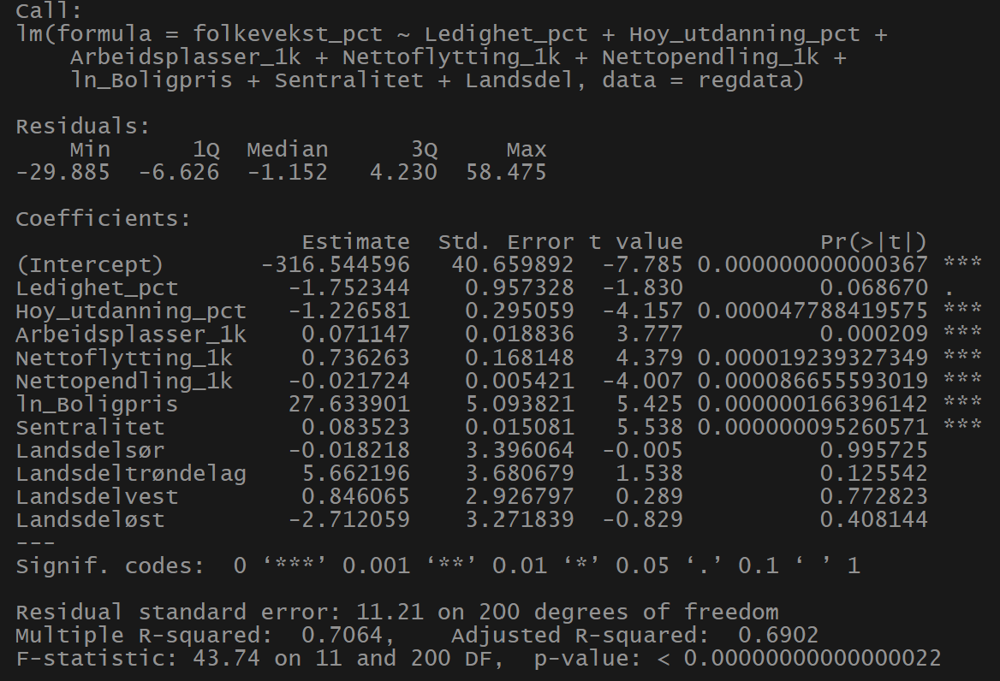2010 viser at flere strukturelle forhold har sterk samvariasjon med folketallsutviklingen i norske kommuner.
Resultatene viser at kommuner som var mer sentrale i 2010, i gjennomsnitt har hatt noe høyere folketallsvekst.
Forskjellen er liten, men målbar (litt høyere sentralitet henger sammen med rundt 0,08 prosentpoeng mer vekst i folketallet).

Boligprisene viser en sterkt positivt vekst knyttet til befolkningsutviklingen.
En økning i logaritmen til boligprisen i 2010 er assosiert med rundt 27,6 prosentpoeng høyere folketallsvekst, noe som indikerer at boligpriser fungerer som en indikator på kommunens attraktivitet.

Når det kommer til antall arbeidsplasser per 1000 innbyggere har de også en positiv og signifikant sammenheng med folketallsvekst.
En økning på 10 arbeidsplasser per 1000 innbyggere i 2010 er forbundet med om lag 0,7 prosentpoeng høyere folketallsvekst.
Tilsvarende har netto innflytting en sterk positiv effekt.
Den viser blant annet at én ekstra person i netto innflytting per 1000 innbyggere i 2010 er assosiert med rundt 0,74 prosentpoeng høyere folketallsvekst.

På den andre siden er netto utpendling negativt assosiert med befolkningsutviklingen.
En økning i netto utpendling på 10 personer per 1000 arbeidsplasser er knyttet til om lag 0,2 prosentpoeng lavere folketallsvekst.
Arbeidsledighet har også en negativ sammenheng med folketallsvekst, der én prosentpoeng høyere ledighet i 2010 er assosiert med rundt 1,75 prosentpoeng lavere folketallsvekst, selv om denne effekten kun er svakt statistisk signifikant.

Når det kommer til Dummyvariablene for landsdel er de ikke statistisk signifikante, noe som indikerer at når det kontrolleres for sentralitet, arbeidsmarked, boligpriser og flyttemønstre, har landsdel i seg selv ingen selvstendig betydning for folketallsutviklingen.

Modellen i seg selv har en relativt høy forklaringsgrad, med en justert R² på rundt 0,69.
Dette betyr at om lag 70 prosent av variasjonen i folketallsvekst mellom kommunene kan forklares av variablene som er inkludert i modellen.
For en tverrsnittsmodell på kommunenivå er dette en høy forklaringsgrad, og det indikerer at forhold som sentralitet, boligpriser, arbeidsmarked, flytting og pendling spiller en viktig rolle for befolkningsutviklingen.
[@ozili]

Samtidig innebærer dette at rundt 30 prosent av variasjonen ikke forklares av modellen.
Dette kan blant annet skyldes forhold som ikke er inkludert i analysen, for eksempel lokale politiske beslutninger, naturgitte forhold eller andre tilfeldige og historiske faktorer.
Resultatene gir dermed et godt, men ikke fullstendig, bilde av hva som påvirker folketallsutviklingen i norske kommuner.

### År 2000 - 2024

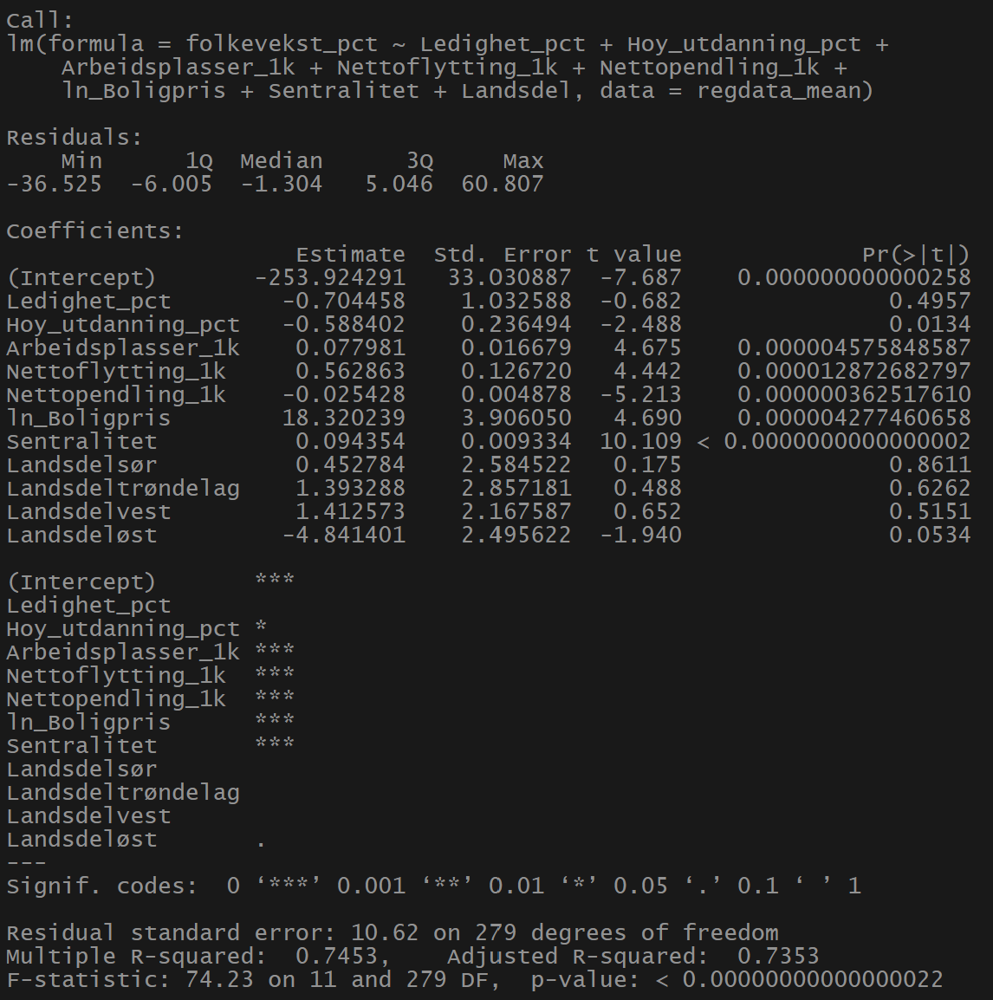

Resultatene fra modellen der forklaringsvariablene er representert ved gjennomsnittsverdier for perioden 2000-2024 viser at flere strukturelle forhold har sterk samvariasjon med folketallsutviklingen i norske kommuner.
Kommuner som i gjennomsnitt er mer sentrale har hatt høyere folketallsvekst.
Effekten er liten per enhet, men tydelig: én enhets høyere sentralitet er assosiert med rundt 0,09 prosentpoeng høyere folketallsvekst, når andre forhold holdes konstante.

Boligprisene har også en klar positiv sammenheng med befolkningsutviklingen.
En økning i logaritmen til boligprisen er assosiert med rundt 18,3 prosentpoeng høyere folketallsvekst, noe som indikerer at boligpriser reflekterer underliggende forhold som gjør kommuner mer attraktive som bosted.

Antall arbeidsplasser per 1000 innbyggere har en positiv og statistisk signifikant sammenheng med folketallsvekst.
En økning på 10 arbeidsplasser per 1000 innbyggere er forbundet med om lag 0,78 prosentpoeng høyere folketallsvekst.
Nettoflytting har også en tydelig positiv effekt: én ekstra person i netto innflytting per 1000 innbyggere er assosiert med rundt 0,56 prosentpoeng høyere folketallsvekst.

Netto pendling har en negativ og statistisk signifikant sammenheng med folketallsutviklingen.
En økning i netto utpendling på 10 personer per 1000 arbeidsplasser er knyttet til om lag 0,25 prosentpoeng lavere folketallsvekst.
Arbeidsledighet har en negativ koeffisient, men effekten er ikke statistisk signifikant i denne modellen.
Andelen med høyere utdanning har en negativ og signifikant sammenheng (om lag -0,59 prosentpoeng per ekstra prosentpoeng), noe som kan tyde på at når sentralitet, boligpriser og arbeidsmarked kontrolleres for, fanger utdanningsvariabelen opp andre strukturelle forskjeller mellom kommuner.

Dummyvariablene for landsdel er i hovedsak ikke statistisk signifikante, som indikerer at når det kontrolleres for sentralitet, boligpriser, arbeidsmarked, flytting og pendling, har landsdel i seg selv liten selvstendig betydning for folketallsutviklingen (landsdel øst er svakt/marginalt signifikant på 10 % -nivå).

Modellen har høy forklaringsgrad, med en justert R² på rundt 0,74.
Dette betyr at om lag 74 prosent av variasjonen i folketallsvekst mellom kommunene kan forklares av variablene som er inkludert i modellen.

Sammenlignet med modellen basert på startårverdier gir gjennomsnittsmodellen noe høyere forklaringsgrad, men hovedmønstrene er de samme: sentralitet, boligpriser, arbeidsmarked og flyttemønstre er de sentrale faktorene for folketallsutviklingen i norske kommuner.

### Paneldatasett i tillegg til årlig vekst

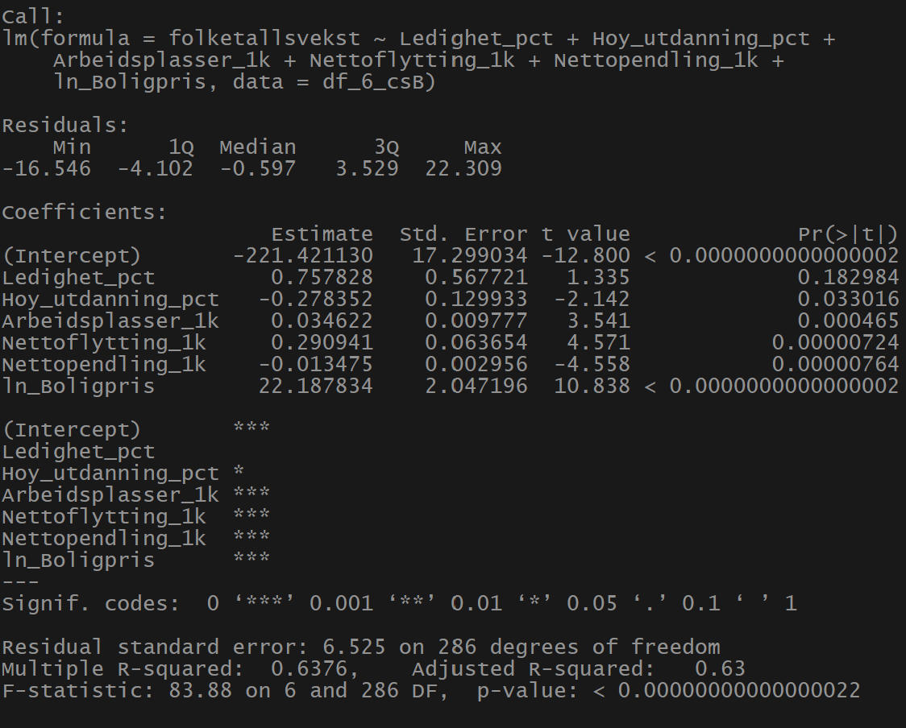

Modell 6B estimerer sammenhengen mellom samlet prosentvis folketallsvekst over perioden og gjennomsnittlige strukturelle kjennetegn ved kommunene i samme periode.
Siden den avhengige variabelen er målt i prosent, kan koeffisientene tolkes som endring i prosentpoeng i folketallsveksten når en forklaringsvariabel øker med én enhet, gitt at øvrige variabler holdes konstante.

Når en ser på resultatene viser den at nettoflytting har en positiv og statistisk signifikant sammenheng med folketallsvekst.
Koeffisienten på 0,29 innebærer at én ekstra person i netto innflytting per 1000 innbyggere i gjennomsnitt over perioden er assosiert med 0,29 prosentpoeng høyere samlet folketallsvekst.
Dette er forventet, ettersom nettoflytting per definisjon innebærer en direkte endring i befolkningens størrelse og dermed naturlig henger sammen med folketallsutviklingen.

Arbeidsplasser per 1000 innbyggere har også en positiv og signifikant sammenheng.
Koeffisienten på 0,035 innebærer at en økning på 10 arbeidsplasser per 1000 innbyggere er assosiert med om lag 0,35 prosentpoeng høyere folketallsvekst.
Dette indikerer at et sterkt lokalt arbeidsmarked bidrar til langsiktig befolkningsvekst.

Netto pendling har en negativ og signifikant koeffisient på - 0,013.
En økning på 10 netto utpendlere per 1000 innbyggere er dermed assosiert med omtrent 0,13 prosentpoeng lavere folketallsvekst.
Dette kan tolkes som at kommuner som i større grad fungerer som bostedskommuner for arbeidstakere i andre kommuner, har svakere egen vekstdynamikk.

Boligpris er inkludert i logaritmert form.
Koeffisienten på 22,19 innebærer at en én prosents økning i boligprisen er assosiert med omtrent 0,22 prosentpoeng høyere folketallsvekst (siden 1 prosent tilsvarer 0,01 i logaritmisk skala).
Dette kan tolkes som at høyere boligpriser reflekterer underliggende attraktivitet og etterspørsel etter å bosette seg i kommunen.

Når en ser på arbeidsledighet og andel med høyere utdanning ligger det ikke robuste og konsistente effekter i denne modellen.
Dette tyder på at når det kontrolleres for arbeidsmarkedets størrelse, flyttestrømmer og boligpriser, har disse variablene begrenset selvstendig forklaringskraft for den langsiktige befolkningsutviklingen.

Modellen har en justert R² på om lag 0,63, noe som innebærer at rundt 63 prosent av variasjonen i kommunenes folketallsvekst kan forklares av de inkluderte variablene.
For en tverrsnittsanalyse på kommunenivå representerer dette en relativt høy forklaringsgrad, og indikerer at arbeidsmarked, flyttemønstre og boligmarked er sentrale strukturelle drivkrefter bak befolkningsutviklingen.

### Sammenligning av de tre regresjonene

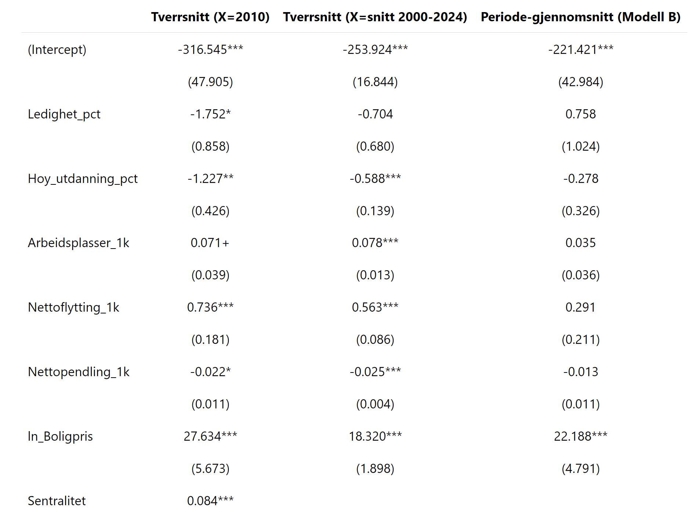

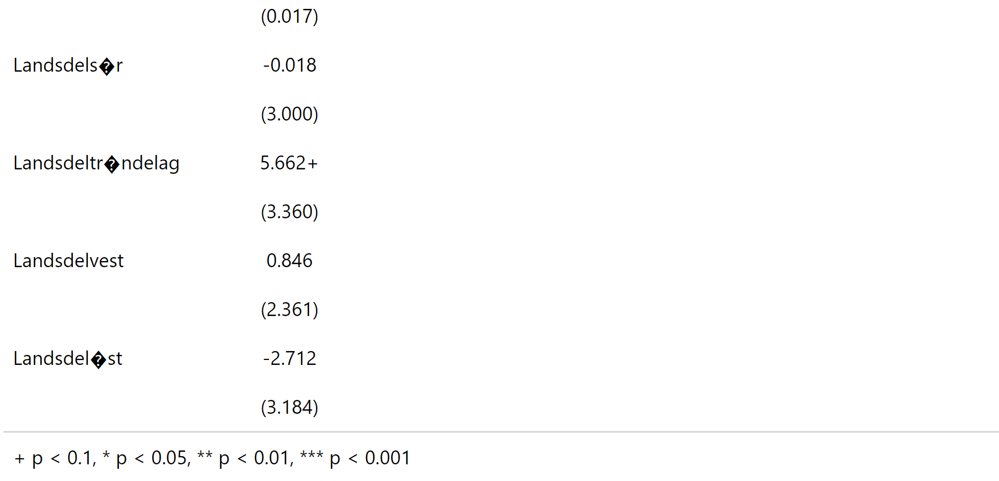De tre modellene analyserer sammenhengen mellom strukturelle kommuneegenskaper og folketallsvekst, men benytter ulike måter å måle forklaringsvariablene på.
Som tidliger bruker den første modellen verdier fra startåret (2010), den andre bruker gjennomsnittlige verdier over perioden 2000 - 2024, mens den tredje modellen (Modell B) benytter periodegjennomsnitt uten landsdels- og sentralitetskontroller og estimeres med robuste standardfeil.

Utifra disse modellene fremstår nettoflytting, arbeidsplasser per innbygger og boligpriser som de mest robuste forklaringsfaktorene.
Nettoflytting har gjennomgående en positiv og statistisk signifikant sammenheng med folketallsvekst, noe som er teoretisk konsistent ettersom flyttestrømmer direkte påvirker befolkningsutviklingen.
Arbeidsplasser per 1000 innbyggere har også stabil positiv effekt i alle modellene, noe som understreker betydningen av et sterkt lokalt arbeidsmarked for befolkningsvekst.
Boligpriser er målt i logaritmisk form og viser en tydelig positiv sammenheng i samtlige spesifikasjoner.
Dette kan tolkes som en indikator på kommunens attraktivitet og etterspørsel etter å bosette seg der.

I modellene finnes det imidlertid enkelte forskjeller.
Startårsmodellen (2010) har høy forklaringsgrad og fanger betydningen av kommunenes strukturelle utgangspunkt.
Gjennomsnittsmodellen (2000 - 2024) gir noe høyere forklaringsgrad og reflekterer mer langsiktige trekk ved arbeidsmarked og bosettingsmønstre.
Modell B har noe lavere justert R², men resultatene er fortsatt konsistente når det gjelder de sentrale variablene.
Hovedmønstrene for modellene holder seg på tvers av spesifikasjonene og styrker dermed selve robustheten i funnene våres.

Variabler som arbeidsledighet og andel med høyere utdanning viser mindre stabile effekter.
Når det kontrolleres for arbeidsplasser, flytting og boligpriser, mister disse variablene ofte statistisk signifikans, noe som tyder på at deres effekt i stor grad opererer indirekte gjennom arbeidsmarked og attraktivitet.

Samlet sett peker analysen på at arbeidsmarkedets størrelse, flyttestrømmer og boligmarkedets styrke er de mest sentrale drivkreftene bak kommunal folketallsvekst.
At disse sammenhengene er stabile på tvers av ulike modellspesifikasjoner, gir økt tillit til at resultatene ikke er drevet av én bestemt modelltilnærming.

# En multippel regresjonsmodell for sysselsettingsvekst

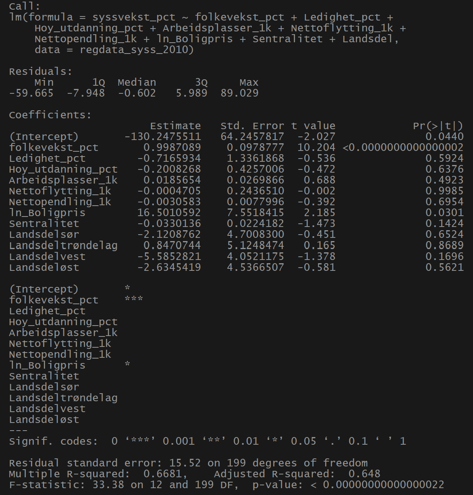

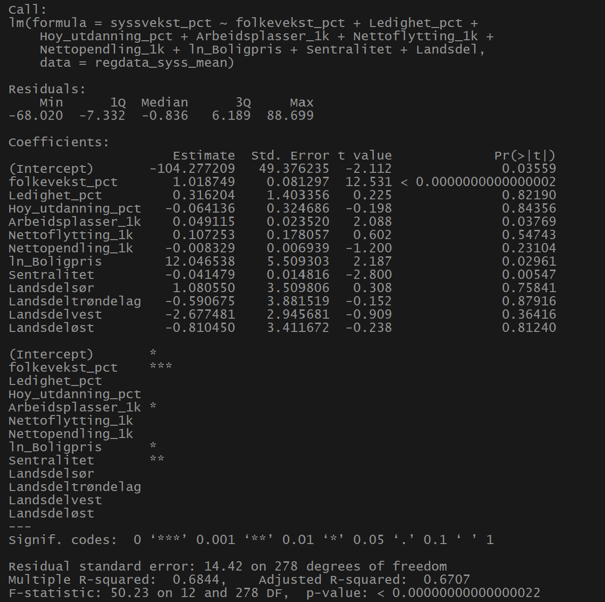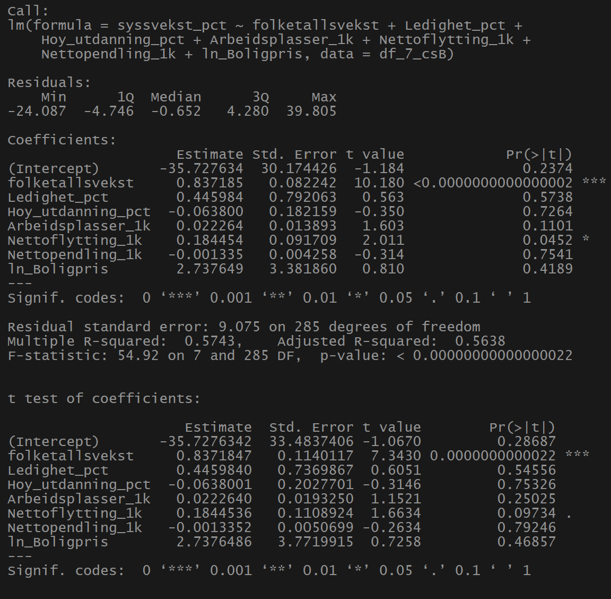Denne modellen analyserer hvilke faktorer som er assosiert med prosentvis sysselsettingsvekst i kommunene
. Koeffisientene kan tolkes som endringer i prosentpoeng sysselsettingsvekst når en forklaringsvariabel øker med én enhet, gitt at øvrige forhold holdes konstante
.

Den sterkeste og mest statistisk robuste sammenhengen finnes mellom folketallsvekst og sysselsettingsvekst.
Koeffisienten på 0,84 innebærer at én prosentpoeng høyere folketallsvekst er assosiert med om lag 0,84 prosentpoeng høyere sysselsettingsvekst.
Dette er teoretisk konsistent, ettersom befolkningsvekst både øker tilbudet av arbeidskraft og etterspørselen etter varer og tjenester.
Flere innbyggere skaper økt behov for handel, bygg, helse, offentlig tjenesteyting og annen lokal produksjon, noe som igjen genererer flere arbeidsplasser.
I tillegg kan befolkningsvekst gi opphav til agglomerasjonseffekter, hvor økt økonomisk aktivitet forsterker produktivitet og sysselsetting ytterligere.

Nettoflytting har også en positiv og svakt statistisk signifikant sammenheng med sysselsettingsvekst.
Koeffisienten på 0,18 indikerer at én ekstra netto innflytter per 1000 innbyggere er assosiert med om lag 0,18 prosentpoeng høyere sysselsettingsvekst.
Dette kan forklares ved at innflytting ofte består av personer i yrkesaktiv alder, noe som både styrker arbeidsstyrken og øker lokal etterspørsel.

De øvrige variablene arbeidsledighet, andel med høyere utdanning, arbeidsplasser per innbygger, nettopendling og boligpriser, viser ingen statistisk signifikant selvstendig sammenheng når det kontrolleres for folketallsvekst.
Dette kan tyde på at deres betydning for sysselsettingsutvikling i stor grad opererer indirekte gjennom befolkningsvekst.
For eksempel kan et sterkt arbeidsmarked eller høye boligpriser først bidra til befolkningsvekst, som deretter stimulerer sysselsettingsvekst.

Modellen har en justert R² på om lag 0,56, noe som innebærer at omtrent 56 prosent av variasjonen i sysselsettingsvekst mellom kommunene kan forklares av de inkluderte variablene.
Samlet sett indikerer resultatene at sysselsettingsvekst i stor grad følger befolkningsveksten, og at arbeidsmarkedets utvikling dermed synes å være tett knyttet til kommunenes demografiske dynamikk.

# Konklusjon

I denne oppgaven har vi analysert regional utvikling i Norge ved hjelp av kart, deskriptiv statistikk, korrelasjoner og flere regresjonsmodeller.
Samlet sett ser vi et tydelig mønster der de mest sentrale kommunene har hatt sterkere befolkningsvekst, høyere sysselsettingsvekst og høyere boligpriser enn mindre sentrale kommuner.
Dette kommer klart frem i kartene, og resultatene støttes også av regresjonsanalysene.

I modellene for folketallsvekst finner vi at nettoflytting, arbeidsplasser per 1000 innbyggere og boligpriser har en tydelig og gjennomgående positiv sammenheng med vekst.
Disse variablene er robuste på tvers av modellspesifikasjonene.
Samtidig ser vi at arbeidsledighet og andel med høyere utdanning ikke alltid er signifikante når vi kontrollerer for andre strukturelle forhold.
Det kan tyde på at disse faktorene i større grad virker indirekte gjennom arbeidsmarked, sentralitet og attraktivitet.

Når vi analyserer sysselsettingsvekst, finner vi at folketallsvekst er den klart sterkeste forklaringsvariabelen.
Det viser hvor tett befolkning og arbeidsmarked henger sammen.
Samtidig skaper dette en viktig metodisk utfordring.
Flere arbeidsplasser kan føre til befolkningsvekst, men økt befolkning kan også skape flere arbeidsplasser gjennom økt etterspørsel.
Dette innebærer en form for simultanitet, der det er vanskelig å skille klart mellom årsak og virkning.

Tilsvarende kan høye boligpriser både være et resultat av vekst og en indikator på attraktivitet som trekker til seg nye innbyggere.
Slike gjensidige sammenhenger skaper utfordringer knyttet til endogenitet.
Selv om modellene våre har relativt høy forklaringsgrad, betyr ikke det at vi kan tolke sammenhengene kausalt.
Paneldata med faste effekter hjelper oss med å kontrollere for faste forskjeller mellom kommuner over tid, men det løser ikke fullt ut problemet med at variablene påvirker hverandre samtidig.

For å komme nærmere en kausal tolkning kunne man i videre analyser brukt laggede variabler mer systematisk, slik at forklaringsvariablene måles før utfallet.
En annen mulighet kunne vært å bruke instrumentvariabler, eller å studere konkrete hendelser som større investeringer eller etablering og nedleggelse av hjørnesteinsbedrifter.
Slike tilnærminger kunne gjort det lettere å isolere effektene av enkeltfaktorer.

Alt i alt viser analysen at regional utvikling i Norge i stor grad henger sammen med sentralitet, arbeidsmarked og flyttemønstre.
Funnene våre samsvarer i hovedsak med teoriene vi har presentert, særlig agglomerasjonsteori og budrenteteori.
Samtidig viser analysen at utviklingen er preget av komplekse og gjensidige sammenhenger.
Resultatene bør derfor tolkes som sterke og konsistente samvariasjoner, heller enn som entydige bevis på årsak og virkning.

# Kildeliste
