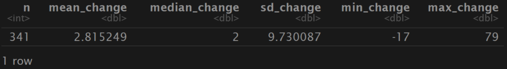
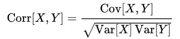
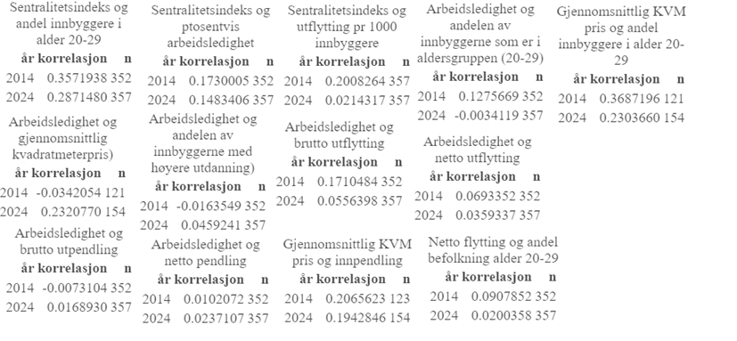
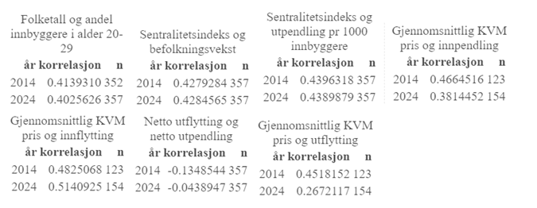
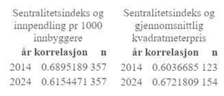
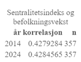
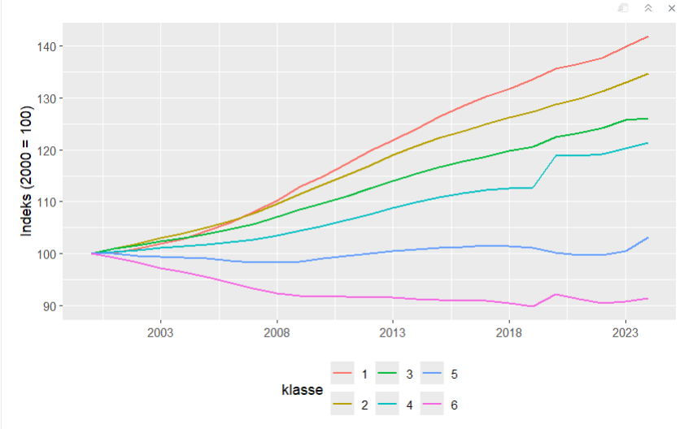
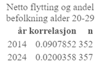
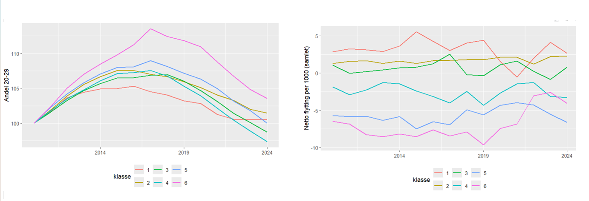
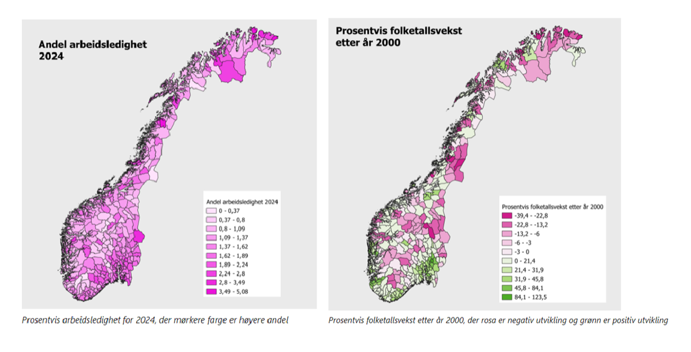

```{r}
#| label: setup
#| message: false
#| echo: true
#| warning: false
#| include: false
library(tidyverse)
library(readxl)
library(modelsummary)
library(dplyr)
library(lmtest)
library(plm)
library(sandwich)

options(scipen = 999)
```

```{r}
load("reg_data.rdata")

load("reg_data_2010.rdata")

load("reg_data_2024.rdata")

load("reg_data_Paneldatasett_log.rdata")

load("reg_data_sammenligning.rdata")

load("modelsummary_oppg6.rdata")

load("reg_data_oppg7_2010.rdata")

load("reg_data_oppg7_mean.rdata")

load("reg_data_m_7B.rdata")
```

## Datainnsamling

## Sentralitetsindeksen for norske kommuner

Beksriver hvor sentralt kommuner ligger.

Indeksen måler hvor lett det er for innbyggerne å nå arbeidsplasser og viktige tjenester, og bygger på beregnet reisetid med bil fra bebodde områder.
På denne måten fanger indeksen opp faktisk tilgjengelighet, der korte reiser teller mer enn lange.

Den er basert på to hovedvariabler: Tilgang til arbeidsplasser (innenfor en reiseramme på opptil 90 minutter) og tilgang på et bredt tjenestetilbud (som handel og offentlig tjenester).

## t-test (2020 - 2023)



Gjennomsnitt har indeksen økt med 2,8%, nedgang og økning (-17, 79)

Tyder på at sentraliteten er ganske stabil i perioden

341 kommuner er med

## Prosentvis arbeidsledighet

NAV og SSB (AKU) måler begge arbeidsledighet, men de gjør det på forksjellige måter.

NAV- Antall registrert i NAVs system

SSB- Hentet fra AKU (Arbeidskraftundersøkelsen)

Bygger på samme ide om hva arbeidsledighet er

## Datainnhenting

Alle data er hentet fra SSB sine sider, her er en oversikt hvilken tabeller som er benyttet.


## Regional utvikling i Norge

Andersson 2019 skriver om Norges utvikling fra 1970 til 2017

Hvordan uliker variabler varierer rundt om i Norge

Høy befolkingsvekst i små kommuner fra 1970 til 1980, så større vekst i store kommuner.

Sentralisering skjer i arbeidsmarkedsregioner, og ikke mellom dem.
Få tegn til økonomisk konvergens mellom regioner i Norge, i motsetning til mange andre europeiske land.

Pendling viktig.

Gjennom sin brede tilnærming gir *Regionale utviklingstrekk 2025* et helhetlig bilde av strukturelle krefter som driver regional utvikling i Norge

## Budrenteteori

Budrenteteorien gir et sentralt analytisk rammeverk for å forstå hvordan geografisk plassering påvirker arealbruk og boligpriser [@capello2016].

Ifølge teorien faller betalingsvilligheten for bolig med økende avstand til sentrum eller sentrale arbeidsmarkeder.

@osland2008 Nyanseres denne teorien

Viser at boligpriser ikke bare påvirkes av fysisk avstand til sentrum, men også av regional arbeidsmarkedstilgjenglighet.

## Harris-Todaro modellen

En modell som sier noe om hvorfor personer flytter til byen selv om det er høy arbeidsledighet.

## Vekst i Norge

Hvorfor vokser noen byer raskere enn andreÅ

Byer med offshorevirksomhet eller andre naturessursbaserte virksomheter som fisk kraft som har gitt en høyere produksjonsvekst enn andre byer [@grünfeld2016].

Den andre hovedforklaringen de peker på er utdanningsnivået til arbeidsstyrken

## Visuell fremstilling av utviklingen i Norge etter 1986

Videre skal vi se på kartfremstillinger som illutreerer utviklinger av diverse variabler

## Folketallsutvikling kart

{width="484"}

## Folketallsutvikling graf

{#fig-nsvnovbre width="407"}

## Befolkningsutvikling 20-29 kart

{width="45%"}

## Befolkningsutvikling 20-29 graf


## Prosentvis arbeidsledighet kart

{width="455"}

## Prosentvis arbeidsledighet graf


## Sysselsettingsvekst kart

{width="492"}

## Sysselsettingsvekst graf


## Kvmpris utvikling kart

{width="459"}

## Kvmpris utvikling graf


## Utdanning utvikling kart

{width="487"}

## Utdanning utvikling graf


## Flytting utvikling kart (18-29)

{width="540"}

## Flytting utvikling kart (30+)

{width="519"}

## Flytting utvikling graf


## Pendling utvikling kart

{width="496"}

## Pendling utvikling graf


## Korrelasjonsberegninger

Et statistisk mål på samvariasjonen mellom to variabler

En positiv koeffisent indikerer positiv kovariasjon og vice versa



## Korelasjon mellom gitte variabler

## Svak samvariasjon

Koeffisient på mellom 0 og 0,40



## Moderat samvariasjon

Koeffisient på mellom 0,40 og 0,60



## Sterk samvariasjon

Koeffisient på mellom 0,60 og 1



## Paneldata

Korrelasjoner basert på årlige endinger innen hver kommuner.

Laget nytt datasett med Delta verdier


## Resultater fra Paneldata analyse


## Trege virkninger


## Spredningsdiagrammer


## Sentralitet og boligpris


## Sentralitet og innpendling


## Arbeidsledighet og utflytting


## Sammenheng mellom befolkning og sysselsetting

```{r}
regresjonTest <- lm(formula = Arbeidssted ~ beftot, data = regresjon)

summary(regresjonTest)
```

```{r}
regresjonTest <- lm(formula = beftot ~ Arbeidssted, data = regresjon)

summary(regresjonTest)
```

```{r}
regresjon_fe <- plm(
  Arbeidssted ~ beftot,
  data = regresjon,
  index = c("knr24", "år"),
  model = "within",
  effect = "twoways"
)

summary(regresjon_fe)
```

Regresjon viser sammenhengen mellom befolkning og sysselsetting

Byttet på befolkning og sysselsetting som avhengig variabel.

Videre forsøkte vi å sette kommune og år som fast effekt for å se om resultatene endret seg noe.

Tidligere så vi på kurver for befolkningsutvikling og sysselsetting

```{r}
regresjon |> 
  select(beftot, Arbeidssted) |> 
  cor() 
```

For å regne ut korrelasjonen har vi brukt antall sysselsatte og antall i befolkning.

For å få et mer hensiktsmessig resultat kunne vi hatt andel sysselsatte eller sett på atbeidsplass per 1000 innbyggere,

## Relevante hypoteser basert på deskriptiv statistikk

Så langt gjennom denne oppgaven er det blitt presentert mye deskriptiv statistikk knyttet til regional utvikling.
Samlet sett gir dette et godt grunnlag for hypoteser for hvordan ulike variabler henger sammen.

## Kommuner med høy sentralitet opplever større befolknignsvekst



{width="581"}

## Kommuner med høy sentralitet opplever større befolknignsvekst

Agglomerasjonsteori

Kulturtilbud

Selvforsterkende vekstprosess

## Kommuner med lav andel innbyggere i alderen 20-29 år opplever høyere neto utflytting





## Kommuner med høy arbeidsledighet vil ha høyere netto utflytting



## Kommuner med stor grad av høy utdanning opplever høyere sysselsetting per 1000 inbyggere

## Magnus del 

Basert på kartvisualisering og korrelasjonsanalyse forventes det en positiv sammenheng mellom sentralitetsindeks og andelen innbyggere med høyere utdanning.
Kartet viser at kommuner med høy utdanningsandel i stor grad er lokalisert rundt større byregioner og mer sentrale områder, mens perifere kommuner gjennomgående har lavere andeler.
Korrelasjonsanalysen for 2024 viser også en moderat positiv sammenheng (r ≈ 0,53), noe som støtter antakelsen om at mer sentrale kommuner tiltrekker eller utvikler en større andel høyt utdannet arbeidskraft.
Samtidig indikerer den moderate styrken på korrelasjonen at sentralitet ikke alene forklarer variasjonen i utdanningsnivå mellom kommuner, og at andre faktorer som næringsstruktur, utdanningstilbud og demografi også kan spille en rolle.

Basert på kartvisualiseringene av netto innpendling og sysselsettingsvekst etter år 2000, samt korrelasjonsanalysen, kan det forventes en sammenheng mellom netto innpendling og sysselsetting per 1000 innbyggere.
Kommuner med høy netto innpendling, altså områder som tiltrekker arbeidstakere fra omliggende kommuner, kan antas å ha et mer dynamisk arbeidsmarked og dermed høyere sysselsettingsnivå.
Samtidig viser korrelasjonsanalysen svært lave korrelasjonskoeffisienter for både 2014 og 2024 (r ≈ 0,01–0,02), noe som indikerer at sammenhengen i praksis er svak eller fraværende.
Dette kan tyde på at pendling i stor grad reflekterer regionale arbeidsmarkedsstrukturer snarere enn direkte sysselsettingsnivå i den enkelte kommune, og at andre faktorer som næringsstruktur, demografi og geografisk beliggenhet også spiller en viktig rolle.

Basert på kartvisualiseringene av sysselsettingsvekst etter år 2000 og gjennomsnittlig kvadratmeterpris for boliger i 2024, kan det forventes en viss positiv sammenheng mellom sysselsettingsvekst og boligpriser.
Kommuner med sterk sysselsettingsvekst kan antas å oppleve økt etterspørsel etter bolig som følge av arbeidsplassvekst og tilflytting, noe som kan bidra til høyere boligpriser.
Samtidig viser korrelasjonsanalysen at sammenhengen er relativt svak, med stor variasjon mellom kommuner.
Dette tyder på at selv om arbeidsmarkedsutvikling kan påvirke boligprisnivået, spiller også andre faktorer som sentralitet, befolkningsvekst, boligtilbud og regionale forskjeller en viktig rolle i utviklingen av boligprisene.

Basert på scatterplotet og kartvisualiseringen av boligpriser, samt korrelasjonsanalysen, kan det forventes en tydelig positiv sammenheng mellom sentralitet og gjennomsnittlig kvadratmeterpris for bolig.
Scatterplotet viser at boligprisene generelt øker med høyere sentralitetsindeks, og sammenhengen fremstår særlig sterk i de mest sentrale kommunene.
Korrelasjonsanalysen viser også relativt høye positive korrelasjoner både i 2014 (r ≈ 0,60) og 2024 (r ≈ 0,67), noe som understøtter at sentralitet er en viktig faktor for boligprisnivået.
Kartet viser samtidig at de høyeste boligprisene er konsentrert rundt større byområder og sentrale regioner.

## En multippel regresjonsmodell for folketallsutvikling

## År 2010

```{r}
load("reg_data_2010.rdata")

summary(mod_oppg6)
```

## År 2000 - 2024

```{r}
load("reg_data_2024.rdata")

summary(mod_oppg6_mean)
```

## Paneldatasett i tillegg til årlig vekst

```{r}
load("reg_data_Paneldatasett_log.rdata")

summary(m_6B)
```

## Sammenligning

```{r}
load("modelsummary_oppg6.rdata")
ms_gt
```

## Multiple regresjonsmodeller for sysselsettingsvekst

Hva som henger sammen med sysselsettingsvekst i norske kommuner i perioden 2000 til 2024.

Alle modellene kontrollerer vi for strukturelle forhold som arbeidsledighet, utdanning, arbeidsplasser per innbygger, nettoflytting, pendling og boligpriser.

Vi har også inkludert sentralitet og landsdelsdummyer.

## År 2010

```{r}

load("reg_data_oppg7_2010.rdata")

summary(mod_oppg7_2010)
```

## Gjennomsnitt År 2010 - 2024

```{r}
load("reg_data_oppg7_mean.rdata")
summary(mod_oppg7_mean)
```

## Samlet vekst 2010 - 2024

```{r}
load("reg_data_m_7B.rdata")
summary(m_7B)
```

## Oppsummert

Folketallsvekst er den klart viktigste forklaringen på sysselsettingsvekst.

Sammenhengen er nesten én-til-én i alle modellene.

Strukturelle faktorer som boligpriser og arbeidsplasser per innbygger spiller en rolle, men er mindre viktige.

Landsdel har ingen selvstendig betydning.

Hovedmønsteret er stabilt på tvers av modellene.

## Konklusjon

De mest sentrale kommunene har hatt sterkere befolkningsvekst, høyere sysselsettingsvekst og høyere boligpriser enn mindre sentrale kommuner

I modellene for folketallsvekst finner vi at nettoflytting, arbeidsplasser per 1000 innbyggere og boligpriser har en tydelig og gjennomgående positiv sammenheng med vekst.

Når vi analyserer sysselsettingsvekst, finner vi at folketallsvekst er den klart sterkeste forklaringsvariabelen.

Tilsvarende kan høye boligpriser både være et resultat av vekst og en indikator på attraktivitet som trekker til seg nye innbyggere.

Analysen at regional utvikling i Norge i stor grad henger sammen med sentralitet, arbeidsmarked og flyttemønstre.

## Kildeliste
